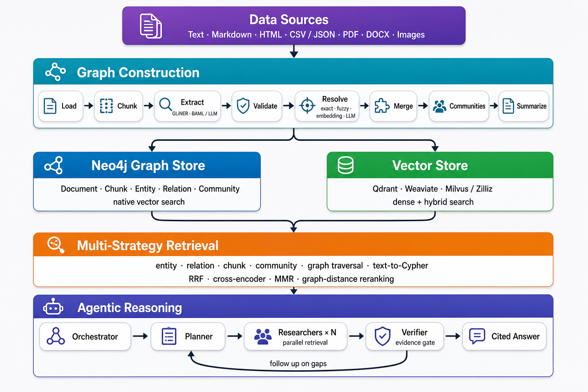

<h1 align="center"><a href="https://github.com/ontogr/agentic-graphrag">Agentic GraphRAG</a></h1>

<div align="center">

[](https://deepwiki.com/ontogr/agentic-graphrag)
[](https://github.com/ontogr/agentic-graphrag/actions/workflows/ci.yml)
[](https://github.com/ontogr/agentic-graphrag/actions/workflows/ci.yml)
[](https://github.com/ontogr/agentic-graphrag/actions/workflows/ci.yml)
[](https://github.com/ontogr/agentic-graphrag/actions/workflows/ci.yml)
[](https://github.com/ontogr/agentic-graphrag/actions/workflows/integration.yml)
[](https://codecov.io/gh/ontogr/agentic-graphrag)
[](https://pypi.org/project/agentic-graphrag/)
[](https://pypi.org/project/agentic-graphrag/)
[](https://ontogr.github.io/agentic-graphrag/)
[](LICENSE)

</div>

Agentic GraphRAG is a modular, schema-driven system for building knowledge graphs from unstructured and structured data, retrieving evidence across graph and vector indexes, and answering questions with agentic reasoning.

<p align="center">
  
</p>

- **One ingestion API** for raw text, files, directories, globs, and prebuilt documents.
- **Structure-aware loading and chunking** with core text readers, Docling for rich documents, and Chonkie for text chunking.
- **Schema-driven extraction** with runtime-defined entity types, relation types, and valid graph patterns.
- **Local-first extraction cascade** using GLiNER 2.5 with type-safe BAML/LLM fallback for weak or ambiguous chunks.
- **Tiered entity resolution** combining exact, fuzzy, embedding, and LLM-verified matching with fail-safe merge rules.
- **Auditable graph merges** with field-level conflict handling, relation repointing, provenance union, and soft tombstones.
- **Pluggable storage** with Neo4j for graph data and native vectors, plus Qdrant, Weaviate, and Milvus/Zilliz for dedicated vector search.
- **Layered retrieval** across entities, relations, chunks, graph neighborhoods, and community reports, with hybrid fusion and reranking.
- **Agentic plan–research–verify loop** that decomposes questions, gathers evidence in parallel, checks coverage, and produces cited answers.
- **OpenTelemetry-native observability** across loading, chunking, extraction, resolution, and storage.

The system is built using:

- [**Docling**](https://github.com/docling-project/docling) and [**Chonkie**](https://github.com/chonkie-inc/chonkie) for document parsing and chunking.
- [**GLiNER 2.5**](https://github.com/urchade/GLiNER) for local schema-guided entity and relation extraction.
- [**BAML**](https://boundaryml.com/) for typed LLM functions and provider-independent client routing.
- [**Neo4j**](https://neo4j.com/) for the property graph and optional native vector search.
- [**Qdrant**](https://qdrant.tech/), [**Weaviate**](https://weaviate.io/), and [**Milvus**](https://milvus.io/) for dense and hybrid retrieval.
- [**Sentence Transformers**](https://www.sbert.net/) and [**FastEmbed**](https://github.com/qdrant/fastembed) for dense and sparse embeddings.
- [**OpenTelemetry**](https://opentelemetry.io/) for vendor-neutral traces and metrics.

## Knowledge Graph

Agentic GraphRAG stores source material, extracted knowledge, and graph summaries in one typed property graph:

```text
(:Document)<-[:PART_OF]-(:Chunk)-[:MENTIONS]->(:Entity:<Type>)
(:Chunk)-[:NEXT_CHUNK]->(:Chunk)
(:Entity)-[:<RELATION_TYPE>]->(:Entity)
(:Entity)-[:IN_COMMUNITY]->(:Community)
(:Community)-[:PARENT_COMMUNITY]->(:Community)
(:Community)-[:HAS_REPORT]->(:CommunityReport)
```

### Documents and chunks

Documents keep their source URI, format, loader, content hash, and record identity. Text formats use content-based identities; binary Docling formats use raw-byte hashes. Chunks keep stable document links and source provenance:

- Text chunks record character and line spans plus their heading path.
- Layout-aware chunks record page numbers and bounding boxes.
- Record formats such as CSV, TSV, JSON, and JSON Lines preserve row identity.

### Entities and relations

Extraction produces mentions first, not graph nodes. Each mention keeps its source chunk, label, text span, confidence, and extractor provenance. Resolution then assigns canonical identities and merges aliases before storage.

Relations are directed subject–predicate–object triples. The active schema constrains valid source type, relation type, and target type combinations, so invalid triples are removed before they reach the graph.

### Communities

Hierarchical community detection groups related entities and relations into nested topics. Each community can receive an LLM-generated report with a title, summary, findings, and importance score. Community reports provide broad context without forcing retrieval to return every low-level edge.

### Runtime schemas

`GraphSchema` is a first-class runtime value. It defines:

- entity types and their descriptions;
- relation types and their descriptions;
- valid `(source, relation, target)` patterns;
- the vocabulary injected into local and LLM extractors.

Use the generic preset for open-domain data or provide a schema for a specific domain. The same schema guides extraction, validation, resolution, storage, and query generation.

## Architecture

Agentic GraphRAG has two main data flows:

```text
Ingestion: source -> document -> chunk -> mentions -> resolved graph -> indexes
Query:     question -> plan -> parallel retrieval -> verify -> cited answer
```

## Ingestion Pipeline

`Graph.add()` is the single entry point for adding content. The complete pipeline is organized into these stages:

1. **Load:** Select a loader by format, decode or parse the source, preserve source metadata, and apply `RAISE`, `SKIP`, or `QUARANTINE` per-source error handling.
2. **Chunk:** Use Docling's layout-aware chunking before flattening rich documents; use Chonkie for text and record documents.
3. **Extract:** Run GLiNER locally against the active schema. Escalate weak results to a typed BAML extraction function when configured.
4. **Validate:** Drop entities and triples that do not conform to the schema.
5. **Resolve:** Apply exact, fuzzy, embedding, and LLM-verified comparison tiers. Ambiguous or failed comparisons do not merge.
6. **Merge:** Resolve properties field by field, combine provenance, deduplicate repointed relations, and retain an audit trail.
7. **Store:** Upsert canonical nodes and relations, then populate graph-native or dedicated vector indexes.

The extraction cascade replaces a weak local result with the LLM result instead of combining two conflicting outputs. Exact matches use global store-backed lookup; more expensive fuzzy and LLM comparisons are blocked to a smaller candidate set.

`Graph.consolidate()` provides a separate whole-graph reconciliation pass for duplicates found across ingestion runs. It is dry-run by default so applications can inspect proposed merges before applying them.

## Embeddings and Storage

The async `Embedder`, `GraphStore`, and `VectorStore` interfaces keep model and database choices outside graph-construction logic.

### Embeddings

- Dense embeddings through Sentence Transformers.
- Sparse BM25 embeddings through FastEmbed.
- Batch-first async APIs with optional content-addressed caching by text and model.
- Dimension checks before collections or indexes accept vectors.

### Graph storage

The Neo4j backend supports local Neo4j and Aura over Bolt, managed read/write transactions, node and relation upserts, constraints, indexes, and native dense vector search. Dynamic labels and relation types are validated before Cypher interpolation.

### Vector storage

| Backend | Dense search | Hybrid search | Deployment |
| --- | --- | --- | --- |
| Neo4j | Yes | No | Local or Aura |
| Qdrant | Yes | Dense + sparse fusion | Local or Cloud |
| Weaviate | Yes | Native BM25/vector weighting | Custom or Cloud |
| Milvus / Zilliz | Yes | Dense + BM25 fusion | Local or Cloud |

All dedicated vector stores share collection lifecycle, batch upsert, retrieval, scrolling, counting, deletion, filtering, dense search, and hybrid search. Filters use exact scalar matches, OR within a list value, and AND across keys.

## Retrieval Pipeline

Retrieval composes small search methods into retrievers, runs them concurrently, and fuses their results through data-only recipes.

- **Entity retrieval** finds canonical entities by dense or hybrid search and can expand matched seeds with bounded graph traversal.
- **Relation retrieval** searches relation representations and hydrates full subject–predicate–object edges from the graph.
- **Chunk retrieval** returns source passages with document and span provenance.
- **Community retrieval** searches community reports for thematic and corpus-wide questions.
- **Text-to-Cypher retrieval** generates a schema-aware, read-only query with bounded retries.
- **Graph traversal** uses bounded, degree-aware breadth-first search to collect connected evidence.

| Recipe | Search methods | Fusion |
| --- | --- | --- |
| `entity`, `relation`, `chunk`, `community` | One focused retriever | Reciprocal Rank Fusion |
| `hybrid_rrf` | Entity + relation + chunk + community | Reciprocal Rank Fusion |
| `hybrid_cross_encoder` | All semantic retrievers + graph expansion | Cross-encoder |
| `bfs_expand` | Entity seeds + bounded graph traversal | Reciprocal Rank Fusion |
| `text2cypher` | Schema-aware Cypher | Reciprocal Rank Fusion |

Reciprocal Rank Fusion, cross-encoder, maximal marginal relevance, and graph-distance rerankers cover different query needs. A recipe can ignore an empty search branch and still return evidence from the remaining methods.

## Agentic RAG Loop

The agent coordinates three roles around the retrieval layer:

- **Planner:** decomposes a question into focused sub-questions and selects a retrieval recipe for each.
- **Researcher:** runs sub-questions in parallel across entity, relation, chunk, community, graph, and Cypher tools; every evidence item keeps its citation.
- **Verifier:** scores coverage and evidence depth, lists unsupported claims, and proposes targeted follow-up searches.

If the evidence gate fails, the missing items seed another research round. When the gate passes, or the iteration limit is reached, the orchestrator produces a structured answer with citations, confidence, caveats, and an answerability flag.

## Structured LLM Output

BAML defines typed extraction, entity-comparison, community-summary, planning, verification, and answer contracts. Runtime client registries support a single provider, fallback chains, or round-robin routing across OpenAI, Anthropic, AWS Bedrock, Google AI, Vertex AI, Azure OpenAI, and OpenAI-compatible endpoints.

## Observability and Failure Handling

OpenTelemetry API support is part of the core package; exporters and the SDK are optional. Applications can send traces to any OTLP-compatible backend.

Long-running graph builds report bounded, structured stage statistics for ingestion, extraction, resolution, merging, and storage. Failures include the affected item, error type, message, and trace/span IDs. Full detail remains in the trace backend so result objects stay bounded on large corpora.

## Installation

Agentic GraphRAG requires Python 3.11 or newer.

```bash
uv pip install agentic-graphrag
```

Install only the integrations you use:

```bash
# Rich documents and local extraction
uv pip install "agentic-graphrag[docling,extract]"

# LLM extraction and local dense embeddings
uv pip install "agentic-graphrag[llm,embed-local]"

# Neo4j with a dedicated Qdrant vector store and OTLP tracing
uv pip install "agentic-graphrag[neo4j,qdrant,observability]"
```

| Extra | Adds |
| --- | --- |
| `docling` | PDF, DOCX, PPTX, image, XML, and layout-aware parsing |
| `extract` | Local GLiNER 2.5 extraction |
| `llm` | BAML-powered extraction and verification |
| `embed-local` | Sentence Transformers dense embeddings |
| `neo4j` | Neo4j graph storage and native vector search |
| `qdrant` | Qdrant dense and hybrid search |
| `weaviate` | Weaviate dense and hybrid search |
| `milvus` | Milvus/Zilliz dense and hybrid search |
| `observability` | OpenTelemetry SDK and OTLP export |

## Usage

### Ingest files and text

```python
import asyncio

from agrag.ingestion import Graph


async def main() -> None:
    graph = await Graph.open()

    files = await graph.add(source="./corpus/**/*.md")
    text = await graph.add(text="Agentic GraphRAG turns evidence into a graph.")

    print(files.documents, len(files.chunks))
    print(text.documents, len(text.chunks))


asyncio.run(main())
```

`Graph.add()` accepts exactly one of:

- `source=` — a file, directory, glob, or list of paths;
- `text=` — raw text as one document;
- `documents=` — prebuilt `Document` objects.

### Handle source failures

```python
from agrag.loaders.corpus.types import ErrorPolicy

result = await graph.add(
    source="./corpus",
    error_policy=ErrorPolicy.QUARANTINE,
)

for uri, reason in result.quarantined_items:
    print(uri, reason)
```

See the [documentation](https://ontogr.github.io/agentic-graphrag/) for guides and the generated API reference.

## Supported Formats

| Format | Extension(s) | Loader |
| --- | --- | --- |
| Plain text and logs | `.txt`, `.log` | Core |
| Markdown | `.md`, `.markdown` | Core |
| AsciiDoc | `.adoc`, `.asciidoc` | Docling, with core fallback |
| HTML | `.html`, `.htm` | Core |
| CSV / TSV | `.csv`, `.tsv` | Core, one document per row |
| JSON | `.json` | Core, record-aware |
| JSON Lines | `.jsonl`, `.ndjson` | Core, one document per row |
| PDF | `.pdf` | Docling |
| Word | `.docx` | Docling |
| PowerPoint | `.pptx` | Docling |
| Images | `.png`, `.jpg`, `.jpeg`, `.tif`, `.tiff`, `.bmp` | Docling |
| XML | `.xml` | Docling or the core XML reader |

Core loaders remain the default for Markdown, HTML, CSV, TSV, and JSON records. Docling takes precedence for layout-rich documents and AsciiDoc when installed.

## Project Structure

```text
agrag/
├── common/data_models/   # documents, chunks, schemas, extraction and storage records
├── chunking/             # Chonkie and Docling chunk adapters
├── loaders/              # core corpus readers and optional Docling loader
├── ingestion/            # Graph API, extraction, resolution, merge and pipeline stages
├── embedding/            # dense and sparse embedding interfaces
├── graphdb/              # graph-store interface and Neo4j backend
├── vectordb/             # vector-store interface and Qdrant/Weaviate/Milvus backends
├── cypher/               # validated Cypher builders
├── retrieval/            # search methods, retrievers, recipes and rerankers
├── agents/               # planner, researcher, verifier and answer synthesis
├── communities/          # hierarchical detection and report generation
├── llm/                  # BAML sources, generated client and provider routing
└── observability.py      # OpenTelemetry helpers

tests/
├── unit/                 # isolated tests with external services mocked
└── integration/          # live backend tests against Docker services
```

## Development

```bash
git clone https://github.com/ontogr/agentic-graphrag.git
cd agentic-graphrag
make sync
make lint-check
make lint-typing
make test
```

Integration tests run against local Neo4j, Qdrant, Weaviate, and Milvus services:

```bash
make dev-services-up
make test-integration
make dev-services-down
```

## Contributing

See [CONTRIBUTING.md](CONTRIBUTING.md) for the development workflow, test conventions, and pull request guidelines.

## References

- [Microsoft GraphRAG](https://arxiv.org/abs/2404.16130) — hierarchical communities and community reports
- [Graphiti](https://github.com/getzep/graphiti) — layered graph search and entity-aware retrieval
- [Cognee](https://github.com/topoteretes/cognee) — data pipelines, graph memory, and consolidation
- [KG-Gen](https://github.com/stair-lab/kg-gen) — knowledge-graph extraction and alias deduplication
- [FalkorDB GraphRAG SDK](https://github.com/FalkorDB/GraphRAG-SDK) — graph-native retrieval and entity resolution
- [Neo4j GraphRAG](https://github.com/neo4j/neo4j-graphrag-python) — Neo4j retrieval and vector integration
- [LightRAG](https://github.com/HKUDS/LightRAG) — graph and vector retrieval
- [PathRAG](https://github.com/BUPT-GAMMA/PathRAG) — relational-path retrieval
- [GLiNER](https://arxiv.org/abs/2311.08526) — generalist zero-shot information extraction
- [BAML](https://boundaryml.com/), [Docling](https://github.com/docling-project/docling), and [Chonkie](https://github.com/chonkie-inc/chonkie)

## License

This project is licensed under the [Apache License 2.0](LICENSE).
