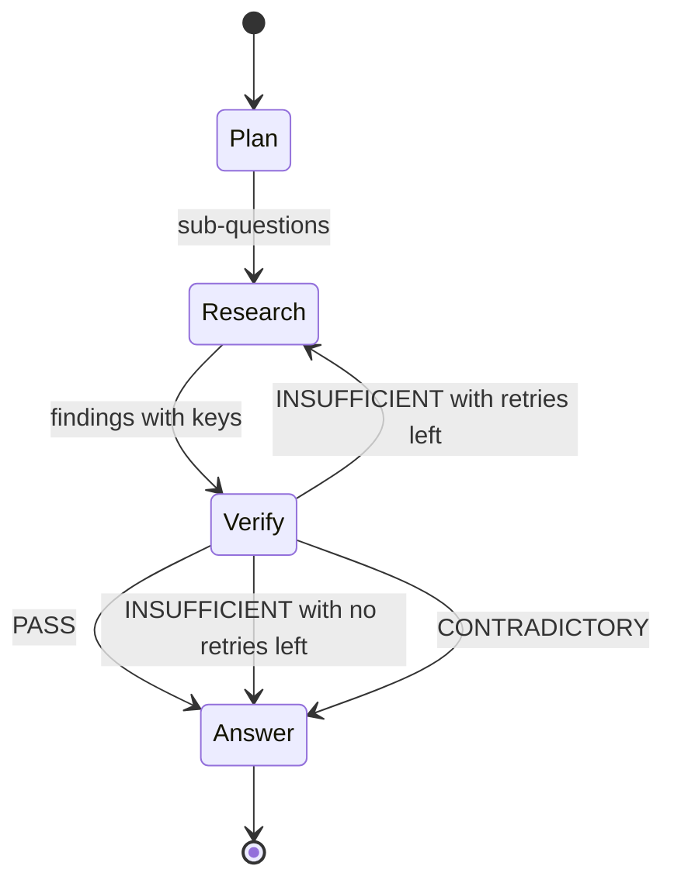

# Agent loop

The agent loop turns one question into a cited answer. A planner splits the question. A researcher gathers evidence from the graph. A verifier reviews that evidence before the planner answers.

## Why it exists

One search often answers only part of a question. "Who worked with Charles Babbage, and where?" needs two facts, and they can sit in different passages. A single vector search returns the closest passages. It does not check that the question is fully answered.

The loop splits the question, so each part gets its own search. It reviews the evidence before it answers. A gap sends the agent back to search again instead of guessing.

Every claim in the answer carries a citation key. Each key points to stored evidence, so you can check the answer yourself.

## How it works

*The verdict decides the next step.*

1. The planner splits the question into two to four sub-questions.
2. The planner sends each sub-question to the researcher. The researcher searches the graph with its tools and reports findings. Each finding carries a citation key.
3. The planner sends the question, the sub-questions, and the findings to the verifier.
4. The verifier checks each sub-question alone. Then it returns one verdict.
5. The planner reads the verdict and acts on it.

| Verdict | Meaning | Next step |
|---|---|---|
| `PASS` | Every sub-question has supporting evidence. Nothing conflicts. | The planner writes the answer. |
| `INSUFFICIENT` | A sub-question lacks evidence, or a claim does not match its evidence. The verdict lists the gaps. | The planner sends the gaps back to the researcher when retries remain. |
| `CONTRADICTORY` | Two cited pieces of evidence conflict. | The planner does not retry. It states the conflict in the answer. |

## A worked example

The question is "Who worked with Charles Babbage, and where?" The graph holds a chunk that says Ada Lovelace worked with Charles Babbage in London.

| Step | What happens |
|---|---|
| Plan | Sub-question 1: who worked with Charles Babbage? Sub-question 2: where did they work? |
| Research | The researcher finds the entity Ada Lovelace (`E1`), the entity London (`E2`), and the chunk that links them (`C1`). |
| Verify | Each sub-question has a key that supports it. The verdict is `PASS`. |
| Answer | "Ada Lovelace worked with Charles Babbage in London [E1][E2][C1]." |

## Citation keys

The agent sees evidence text that starts with a key. The letter of the key names the kind of evidence.

| Key | Evidence |
|---|---|
| `E1` | An entity, or a resolved entity |
| `R1` | A relation |
| `C1` | A chunk of source text |
| `G1` | A community report |
| `V1` | A value from a graph query |

A run hands out keys in order and never changes one. Each call to the agent starts with an empty ledger, so two questions never share keys.

## Limits

By default, the planner can send work back to the researcher three times. The count starts after the first verifier check, so the first research pass is free. When the limit is reached, the planner answers from the evidence it has. It names the sub-questions that it did not answer. A limit of 50 graph steps stops a run that loops for another reason.

The result has two parts. `messages` ends with the answer. `ledger` maps each key to its evidence.

:::note
The full loop needs the `agents` extra. Without it, `build_agent` returns a simpler agent. That agent runs one search and writes one answer. It has no planner, researcher, verifier, or step limit.
:::

Design choices

Why does the verdict have three values? More searching cannot fix two sources that disagree. `CONTRADICTORY` stops the retries and moves the conflict into the answer. `INSUFFICIENT` is the only verdict that starts another search.

Why does the verifier have no tools? It judges only the evidence in front of it. It cannot search until the researcher's claim looks right. The planner cites keys. The library attaches the evidence text for each key to the verifier's task, so the verifier can decide whether each key supports its claim.

Why can a scope stay hidden from the model? You can limit every search to one document or tenant. Each tool applies the scope and refuses an argument outside it. The tool that runs generated Cypher is removed, because a generated query cannot stay inside a scope.

## Related

- Guide: [Retrieve and answer](../guides/retrieve-and-answer.mdx)
- Guide: [Trace an agent run](../guides/trace-an-agent-run.mdx)
- Concepts: [Retrieval](./retrieval.mdx), [Observability](./observability.mdx)
- Reference: [Agents API](/api/agents), [Configuration](../reference/configuration.mdx)
