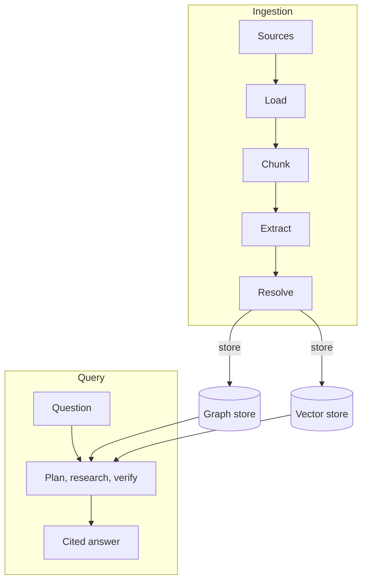

# Architecture

Agentic GraphRAG has two flows. The ingestion flow turns documents into a knowledge graph. The query flow answers a question from that graph.

## Why it exists

A vector search finds passages that look like the question. It cannot follow a link between two facts that sit in different documents.

Agentic GraphRAG stores the facts as a graph and keeps the source text next to them. A question can use both: the passage that states a fact, and the entities that connect passages.

The system splits the work into small components. Each component has one job and one interface. You can replace the embedder, the graph store or the vector store without changing the rest.

## How it works

*The ingestion flow writes to the stores. The query flow reads from them. The vector store is optional. The Agent loop page shows the plan, research and verify steps in detail.*

The ingestion flow has five stages:

1. Load. A loader reads each source and makes documents.
2. Chunk. A chunker splits each document into chunks. It records where each chunk came from.
3. Extract (see [Extraction](./extraction.mdx)). An extractor finds entities and relations in each chunk.
4. Resolve (see [Entity resolution](./resolution.mdx)). The resolver decides which mentions name the same thing.
5. Store. The graph store keeps documents, chunks, entities and relations. An embedder adds vectors.

The query flow has four steps:

1. The planner splits the question into sub-questions. The [Agent loop](./agent-loop.mdx) page describes the planner, the researcher and the verifier.
2. The researcher searches the graph and the chunks.
3. The verifier decides whether the evidence answers each sub-question.
4. The planner writes the answer and cites its evidence.

You call `Graph.add` for the first flow and `build_agent` for the second. Both use the same graph store, embedder and schema.

## Example

A note says that Ada Lovelace worked with Charles Babbage in London on the Analytical Engine. The loader makes one document. The chunker makes one chunk. The extractor finds entities such as two people, one place and one product. The store writes the document, the chunk and the entities, and links the chunk to each entity. A later question about Babbage finds the chunk through the Babbage entity, and the answer cites that chunk.

Design choices

Why a graph store and a vector store? The [Graph storage](./graph-storage.mdx) page compares them. The graph keeps structure and provenance. A vector index finds similar text fast. Neo4j has a native vector index, so the second store is optional. Add Qdrant, Weaviate or Milvus when you want a dedicated search service.

Why must you pass in the components? `Graph.open` takes the store, the embedder, the extractor and the schema as arguments. The library has no global configuration for them. Two graphs in one process can use different stores. A test can pass a fake.

Why is the schema required? Extraction, validation and storage all use the schema. Without one, each stage guesses what an entity is. The `GENERIC` preset gives a starting point.

Why are the public APIs async? Ingestion and search wait on models and databases. Async calls let the library run those waits together.

## Related

- [Knowledge graph](./knowledge-graph.mdx) describes what the graph holds.
- [Ingestion pipeline](./ingestion.mdx) describes the first flow in detail.
- [Quickstart](/get-started/quickstart) builds a small graph.
- [API reference](/api) lists every class and function.
