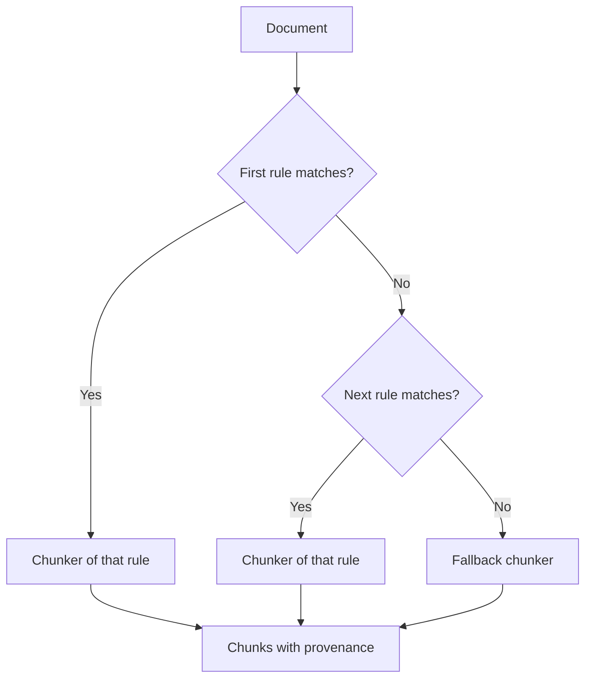

# Chunking

A chunker splits a document into chunks. Each chunk records where in the source it came from.

## Why it exists

Search and extraction work on short pieces of text. Where you cut decides what they can find. A cut in the wrong place can separate a name from the fact about it.

A chunk also has to be citable. Each chunk keeps its position in the source, so an answer can point to the exact place.

## How it works

*The first rule that matches picks the chunker. A document that matches no rule gets the fallback.*

A `Chunking` value holds an ordered list of rules and a fallback. A rule matches on the loader name, the source format, the document family or a URI pattern. When a rule sets more than one of these, all must match. The first matching rule wins.

The default has one rule. A document that the docling loader read goes to the docling chunker, which follows the page layout. Every other document goes to the fallback: a recursive chunker with chunks of up to 1,024 characters.

### Strategies

| Strategy | What it does |
| --- | --- |
| Recursive | Cuts at paragraph, sentence and word boundaries, coarsest first |
| Token | Cuts at a fixed token count |
| Sentence | Groups whole sentences |
| Heading | Cuts sections at headings, then packs them to a size |
| Turn window | Packs whole chat turns and never cuts inside one |
| Parent and child | Cuts large parents, then small children inside them |
| Docling | Follows the layout of a parsed page document |
| Semantic, Neural, Code | Optional. Cut by meaning, by a topic model, or by code syntax |

The optional strategies need the `chunk-semantic`, `chunk-neural` or `chunk-code` extra. The heading strategy reads the headings that the Markdown and AsciiDoc loaders record.

### What a chunk carries

- **Location.** A text chunk keeps a character range in the normalized document text. It also keeps a line range when the loader tracks lines. A docling chunk keeps page numbers and a box on each page.
- **Headings.** A text chunk keeps the headings above it.
- **Origin.** A chunk records its chunker name and a fingerprint of the chunker settings.
- **Identity.** A text chunk id comes from the document and the character range. A docling chunk id comes from the document, the chunker fingerprint and the chunk number.

### Parent and child chunks

Parent and child chunking makes two levels. A parent is large. Extraction reads parents. A child is small and lies inside one parent. Only children are embedded and searched. A search hit returns the child with its parent attached.

If the child strategy leaves out some text, that text becomes a child of its own. All non-blank text stays searchable.

## Example

A Markdown handbook has a section with three paragraphs. With the default fallback, the recursive chunker cuts at paragraph boundaries until each chunk fits in 1,024 characters. Each chunk stores its character range and its headings, such as "Handbook > Leave policy". Suppose you change the chunk size and call `Graph.update` for the file. Agentic GraphRAG chunks it again, even though the text did not change. The character ranges change, so the chunk ids change.

Design choices

**Why are chunking rules plain data?** A list of rules is easy to read and compare. No hidden logic assigns documents to strategies. A change to any rule changes the fingerprint.

**Why does Agentic GraphRAG own the chunk contract?** Chonkie and docling do the cutting, but they sit behind Agentic GraphRAG's chunkers. Every chunk then has the same fields, whichever engine made it.

**Why does the default count characters?** A character count needs no tokenizer model. The default changes only when a benchmark shows that another strategy does better.

**Why do parents and children exist?** Extraction wants wide context to find relations. Search wants small pieces to match precisely. Two levels give each what it needs.

**Why record the chunker on each chunk?** `Graph.update` compares it with the chunker that the rules pick now. If the settings changed, the document is chunked again even when its text did not change.

## Related

- [Loading documents](./loading.mdx) describes how the text is read and normalized.
- [Configure chunking](/guides/configure-chunking) shows how to set rules and strategies.
- [Chunking API](/api/chunking) lists every chunker and its settings.
