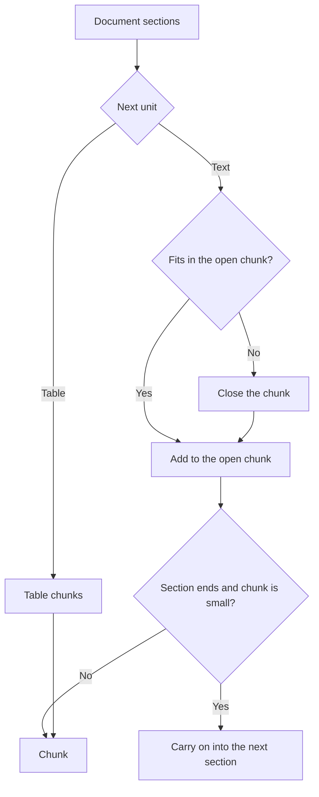

# Chunking

The chunker packs the sections of a document into chunks. Each chunk records where in the source it came from and which sections it holds.

## Why it exists

Search and extraction work on short pieces of text. Where you cut decides what they can find. A cut in the wrong place can separate a name from the fact about it.

A document already has structure: headings, paragraphs and tables. The chunker uses that structure, so a chunk stays inside the section that holds its text. A chunk must also be citable. Each chunk keeps its position in the source, so an answer can point to the exact place.

## How it works

*The chunker fills a chunk with the units of a section, then starts a new one. A small chunk carries on into the next section.*

1. Pack. The chunker walks the sections in reading order. A unit is a paragraph, list, code block or formula. The chunker adds units to a chunk until the next unit would pass `size` tokens. The default size is 600 tokens.
2. Split. A unit that is over `size` on its own is cut at paragraph, sentence, clause or word boundaries. The cut keeps the exact text.
3. Merge. When a section ends and the open chunk has fewer than `min_size` tokens, the chunk carries on into the next section. The default `min_size` is a quarter of `size`. The next heading goes into the chunk text, so the text keeps its meaning.
4. Tables. A table never mixes with text. A table that fits in `size` tokens is one chunk. A larger table becomes row groups. Each group repeats the header row, and the first group starts with the caption.

One `Chunker` serves every format. A `Graph` takes one `Chunker`. There are no per-format rules.

### What a chunk carries

- Location: a chunk from a text source keeps a character range in the normalized document text, and its text is an exact slice of that text. A chunk from a PDF, slide deck or spreadsheet keeps page numbers and a box on each page. A chunk from a Word, HTML or Markdown file has no page spans, because those formats have no pages.
- Headings: a chunk keeps the headings above it in `heading_path`.
- Sections: a chunk lists the sections whose text it holds in `section_ids`. In the graph it sits under the lowest section that holds all of that text. A table chunk sits under its table.
- Origin: a chunk records the name of the chunker and a fingerprint of its settings.
- Identity: a chunk id comes from the document, its version, the chunker fingerprint and the chunk number. A new version or new settings give new ids.

### Record rows and chat

A record row, such as one CSV row, has no sections. Its text is one unit, so it is one chunk. A chat file has one section for each message. A window of short messages can share one chunk.

## Example

A report has a section "Results" with three short paragraphs and a table. The chunker packs the three paragraphs into one chunk of about 300 tokens. The table becomes its own chunk, with the header row first. A search for a figure in the table returns the table chunk. The agent can then read the section "Results" through the graph.

Suppose you change `size` from 600 to 400 and call `Graph.update` for the file. Agentic GraphRAG chunks it again, even though the text did not change. The settings fingerprint changed, so the chunk ids change.

Design choices

Why one chunker for all formats? Every loader gives the same input: sections made of units. A single packer then behaves the same for every format. A per-format choice would also make loading harder to predict.

Why one level of chunk? Extraction and search use the same chunk. The agent gets wider context by walking from the chunk to its section in the graph. A second, larger level would double the embeddings.

Why 600 tokens? Smaller chunks gave more entities per token in the Microsoft GraphRAG study, and they make search results sharper. The default is a starting point. The benchmark harness compares it with 1,000 tokens.

Why does a small chunk carry on into the next section? Sections that hold a line or two make chunks that embed badly and cost an extraction call each. Carrying on removes most of them.

Why record the chunker on each chunk? `Graph.update` compares its fingerprint with the current one. If the settings changed, the document is chunked again even when its text did not change.

## Related

- [Loading documents](./loading.mdx) describes how the sections are read.
- [Configure chunking](/guides/configure-chunking) shows how to set the size.
- [Chunking API](/api/chunking) lists the chunker and its settings.
