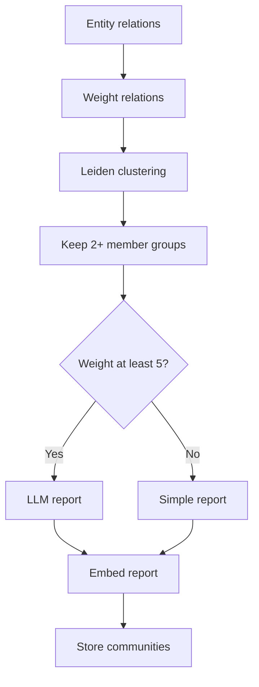

# Communities

A community is a group of entities that many relations connect. agrag finds communities when you ask, and it writes a short report for each one.

## Why it exists

Some questions have no single chunk as an answer. "What are the main themes in this corpus?" needs a broad view. A list of every fact is too long to read.

A community report gives that view. It summarizes one cluster of the graph in a title, a summary, and a few findings. A search can return the report and skip the low-level edges.

## How it works

*Groups with many attested relations get an LLM report. Small groups get a simple one.*

1. You call `Graph.detect_communities`. `Graph.add` never calls it.
2. agrag reads every relation between entities. It weights each relation by the number of chunks that state it. A relation with no source chunk weighs zero.
3. Leiden clustering splits the entities into groups. The clustering is hierarchical. agrag keeps only the first level, which holds the broadest groups, and only groups of two or more entities.
4. agrag sums the weight of the relations inside each group. This is the internal weight. It also ranks each member by its own internal weight.
5. A group with an internal weight of 5 or more gets an LLM report. The report has a title, a summary, a rating from 0 to 10, a reason for the rating, and findings. A smaller group gets a simple report. Its title lists the three top members. Its rating is half of its internal weight, up to 10. If no LLM is available or a call fails, agrag writes the simple report and records the failure.
6. agrag embeds each title and summary, so that retrieval can search communities.
7. agrag deletes the earlier communities and writes the new ones. Each detection replaces the last.

A dry run, which is the default, returns the groups without reports.

## Example

Seven short documents about early computing give three communities.

| Members | Internal weight | Report | Title |
| --- | --- | --- | --- |
| Babbage, Lovelace, London, and two machines (5) | 6.0 | LLM | Early Computing Pioneers in London |
| Hopper, Philadelphia, UNIVAC compiler (3) | 3.0 | Simple | Grace Hopper, Philadelphia, UNIVAC compiler |
| Turing, Bletchley, Bombe (3) | 2.0 | Simple | Alan Turing, Bombe, Bletchley |

An LLM writes the first report, and an LLM can make mistakes. In one test run, a finding said that Ada Lovelace designed the Analytical Engine. The source text says that she wrote notes on it. Check findings against the relations.

Design choices

**Why weight relations by chunk count?** A relation that many chunks state counts more. A relation without a source chunk cannot inflate a community.

**Why decide the report type by internal weight and not by size?** A small group with many attested relations can matter more than a large sparse group.

**Why keep a simple report?** It costs no LLM call and it is the same on every run. Most groups in a large graph are small.

**Why keep only the first level?** One level of groups is enough for retrieval. It also keeps the number of `Community` nodes small.

**Why rebuild every time?** A full rebuild gives one clean partition. There is no rule for merging an old partition with a new one.

**Why run on request?** Clustering reads the whole graph. You choose when to pay for it.

## Related

- Guide: [Detect communities and read reports](/guides/detect-communities)
- Previous: [Matching and resolved entities](/concepts/resolved-entities)
- Concept: [Knowledge graph](/concepts/knowledge-graph)
- Reference: [Core API](/api)
