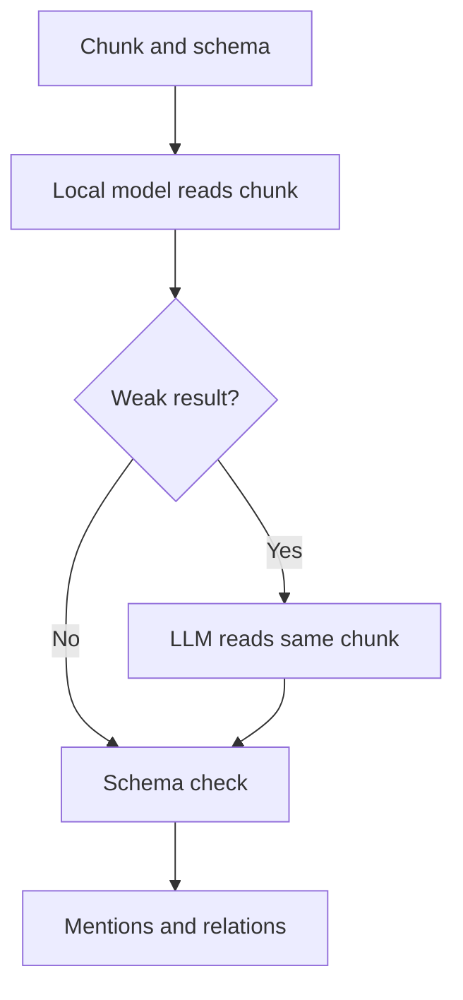

# Extraction

Extraction reads one chunk and lists its entities and relations. Every result must match a schema that you define.

## Why it exists

A chunk is plain text. A graph needs typed facts, such as "Charles Babbage designed the Analytical Engine". Extraction finds those facts.

A schema keeps the facts consistent. It names the valid entity types and relation types. It also names the pairs of types that each relation can join. An extractor cannot add a type that the schema does not declare.

Extraction can also cost a lot. An LLM that reads every chunk charges for every chunk. A small model on your machine reads every chunk for free. An LLM reads only the chunks where the small model looks weak. This is the local-first cascade.

## How it works

*The local model reads every chunk. The LLM result replaces a weak local result.*

1. The extractor receives one chunk and the schema.
2. The local model (GLiNER 2.5) proposes entities. Each entity has a label, a text span, and a confidence score. It also proposes relations between the entities.
3. The cascade examines the result. It escalates in two cases. The local model found no entities in a chunk of at least eight words. Or the mean confidence of the entities is below 0.5.
4. When the cascade escalates, an LLM reads the same chunk. The schema is part of its prompt. The LLM result replaces the local result. The cascade never combines the two.
5. Validation removes every entity whose label the schema does not declare. It removes every relation whose label, or whose pair of entity types, the schema does not declare. It removes every property that the schema does not declare.
6. The result is a list of mentions. A mention is not a graph node yet. It keeps its chunk, label, text, character span, and confidence.

The cascade is a choice that you make when you open a graph. If you give the graph only the local extractor, no chunk goes to an LLM.

:::note
The local model reports spans and labels. It does not fill property values. Use an LLM extractor for chunks where you need properties.
:::

## Example

A schema declares the entity types `Person`, `Machine`, and `City`. It declares the relations `DESIGNED` (Person to Machine) and `WORKED_IN` (Person to City). The local model reads two sentences.

| Text | Mentions | Relations |
| --- | --- | --- |
| Charles Babbage designed the Analytical Engine in London. | Charles Babbage (Person), Analytical Engine (Machine), London (City) | Charles Babbage DESIGNED Analytical Engine |
| Ada Lovelace worked in London and wrote notes on the Analytical Engine. | Ada Lovelace (Person), London (City), Analytical Engine (Machine) | Ada Lovelace WORKED_IN London |

The two sentences give six mentions. After resolution, they are four entities, because the two "London" mentions and the two "Analytical Engine" mentions have equal text.

Design choices

Why replace and not combine? Two extractors can mark overlapping spans in different ways, for example "Analytical Engine" and "the Analytical Engine in London". Reconciling them is the work of entity resolution. Extraction keeps one source for each chunk.

Why use the mean confidence? One uncertain entity does not make a whole chunk weak. The mean looks at the entire result.

Why escalate an empty result only for chunks of eight words or more? A short chunk with no entities is often correct. A long chunk with no entities is usually a miss.

Why validate after extraction? An LLM can invent a type or a property. The schema is the contract. Validation is the last step for every extractor, so the graph never receives an undeclared type.

## Related

- Guide: [Define a graph schema](../guides/define-a-graph-schema.mdx)
- Guide: [Extract and resolve entities](../guides/extract-and-resolve.mdx)
- Next: [Entity resolution](./resolution.mdx)
- Reference: [Ingestion API](../api/ingestion/index.md)
