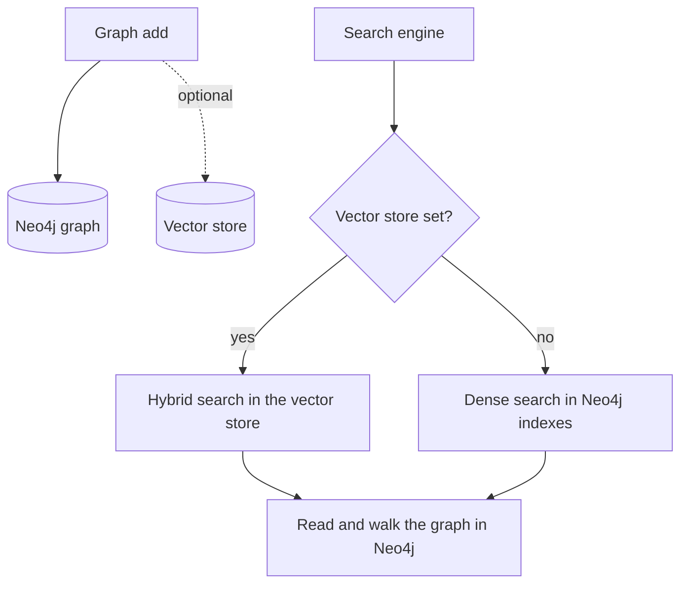

# Graph storage

Agentic GraphRAG keeps the graph in Neo4j. It can also copy every embedding into a separate vector database, which adds keyword and blended search.

## Why it exists

A graph and a vector index do different jobs. The graph holds entities and the relations between them, and it lets the engine walk from one entity to the next. A vector index finds items whose meaning is close to a query. A graph search needs both.

Neo4j holds the graph and has vector indexes of its own. That is enough for dense search, and it means one service to run. A dedicated vector database adds keyword search and a weighted blend of the two. Agentic GraphRAG lets you pick either setup.

## How it works

*Neo4j always holds the graph. The vector store is optional and only changes how the first search runs.*

1. Write. `Graph.add` writes documents with their sections, tables and figures, chunks, entities, and relations to Neo4j. It also writes an embedding for each entity and chunk.
2. Copy (optional). When you open a graph with a vector store, Agentic GraphRAG creates four collections: entities, resolved entities, chunks, and communities. It writes every embedding to both stores, so the two search paths see the same data.
3. Search. With a vector store, the engine runs hybrid search there. Without one, the engine runs dense search in the Neo4j vector indexes.
4. Read. The engine reads the full items back from Neo4j and walks the graph when the recipe asks for it.

## The two stores

| Store | Holds | Searches |
|---|---|---|
| Graph store (Neo4j) | Sources of record files, documents, sections, tables, figures, chunks, entities, resolved entities, relations, communities, and the vector indexes | Dense vector search, graph walks, read-only graph queries |
| Vector store (optional) | Embeddings and filter fields for entities, resolved entities, chunks, and communities | Dense search and hybrid search |

Neo4j is the only graph store today. It must be version 5.23 or newer. A local server in Docker and a hosted server such as Aura both work.

## Vector store backends

| Backend | Dense | Hybrid | How hybrid works | Where it runs |
|---|---|---|---|---|
| Neo4j indexes | Yes | No | Not available | Local or hosted |
| Qdrant | Yes | Yes | Agentic GraphRAG builds a keyword vector on the client. It scores two searches and blends them with a weight. | Local or cloud |
| Weaviate | Yes | Yes | Weaviate blends dense and keyword scores with the weight. | Local or Weaviate Cloud |
| Milvus | Yes | Yes | Milvus builds the keyword scores on the server and applies the weight. | Local or hosted |

The weight is a number from 0 to 1. A value of 1 means dense search only. A value of 0 means keyword search only. The default is 0.5.

## Embedders

An embedder turns text into a vector. The default embedder runs a FastEmbed model on your machine. The default model produces 384 values per text. Qdrant hybrid search also uses a keyword embedder.

`Graph.open` compares the embedder's dimension with each vector index in Neo4j and each collection in a vector store. It raises an error when they differ. It raises before it writes any vector.

## A worked example

You search for a part number such as "AX-4471". A dense search compares meaning, and a part number has little meaning to compare. With Neo4j alone, the search can miss the exact chunk. With a vector store, keyword search finds the chunk by the exact text, and the blend places it high in the results.

Design choices

Why is Neo4j the only graph store? The graph store interface allows other backends. Only Neo4j is implemented, because the ingestion and retrieval queries are written in Cypher.

Why is the vector store optional? Neo4j alone gives dense search and one service to run. A second database adds keyword and blended search, and one more thing to run and back up. You choose when the gain is worth it.

Why write to both stores at ingestion? A background copy job can lag behind the graph. Writing to both in the same call keeps the two search paths on the same data.

Why does Qdrant blend two searches? Qdrant's own fusion has no weight. Agentic GraphRAG scores the dense search and the keyword search separately, scales both, and blends them with the weight. Weaviate and Milvus apply the weight natively.

## Related

- Guide: [Configure storage backends](../guides/configure-storage-backends.mdx)
- Guide: [Troubleshoot common errors](../guides/troubleshoot-common-errors.mdx)
- Concepts: [Knowledge graph](./knowledge-graph.mdx), [Retrieval](./retrieval.mdx)
- Reference: [Graph store API](../api/graphdb/index.md), [Vector store API](../api/vectordb/index.md), [Embedding API](../api/embedding/index.md), [Configuration](../reference/configuration.mdx)
