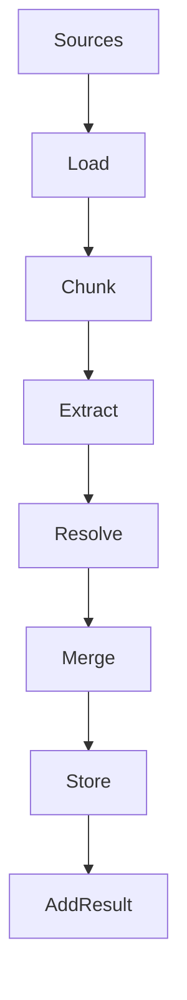
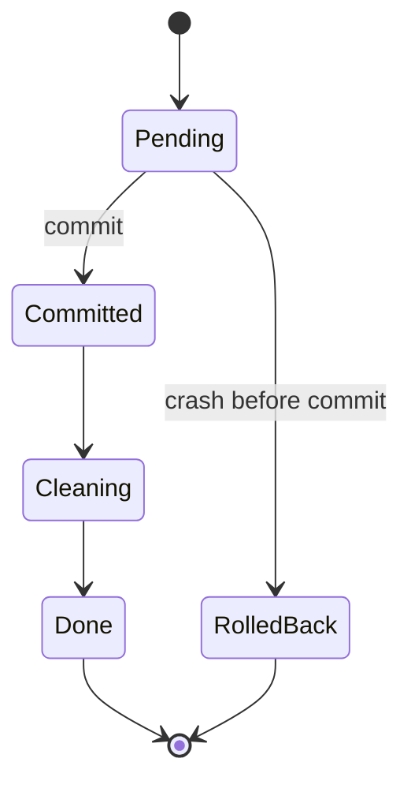

# Ingestion pipeline

`Graph.add` turns sources into graph content in six stages. One call handles text, files, folders and prebuilt documents.

## Why it exists

Ingestion has many parts that can fail: a corrupt file, a slow model call, a lost database connection. One pipeline gives every source the same steps, the same summary and the same failure rules.

The same pipeline also backs `Graph.update`. New content and changed content take the same path, so they behave the same way.

## How it works

*Each stage hands its output to the next. The result reports every stage.*

1. **Load.** A loader reads each source and makes documents. The error policy decides what happens when a source fails. See [Loading documents](./loading.mdx).
2. **Chunk.** A chunker splits each document into chunks. See [Chunking](./chunking.mdx).
3. **Extract.** The extractor (see [Extraction](./extraction.mdx)) reads each chunk and finds entities and relations. It drops any entity or relation that the schema does not allow. When a chunk has a parent chunk, extraction reads the parent, not the children.
4. **Resolve.** The resolver (see [Entity resolution](./resolution.mdx)) looks for mentions that name the same thing. It first checks exact names against the whole store. It then compares the remaining mentions with each other and with stored entities. A language model checks only the pairs that stay unclear, and the number of such checks has a cap.
5. **Merge.** For entities that share a name, Agentic GraphRAG decides each property value and joins the chunk ids that mention them. Fuzzy, embedding and LLM matches are not merged. See [Matching and resolved entities](./resolved-entities.mdx).
6. **Store.** The graph store (see [Graph storage](./graph-storage.mdx)) writes chunks, documents, entities, relations and the edges between them. The embedder adds vectors. An optional vector store gets a copy.

`Graph.add` returns an `AddResult`. It holds one summary for each stage: ingestion, chunking, extraction, resolution, merge and storage. Each summary lists failures. A failure carries a trace id, so you can find the full record in your tracing tool.

### Crash safety

`add`, `update` and `delete_document` each run as a job. The job tags every write with its own id, and search skips tagged writes. Nothing becomes visible until the job commits.

*A job that stops before its commit rolls back. A job that stops after it rolls forward.*

If a process stops during a call, the next `Graph.open` finds the unfinished job. It removes the tagged writes of a job that had not committed. It finishes the cleanup of a job that had. A running job renews a lease of 60 seconds by default. Another process takes over only after the lease runs out.

## Example

You call `Graph.add` with a folder of 200 files and `ErrorPolicy.SKIP`. One file ends in `.dat`, and no loader reads that extension. The loader skips it and counts it. The other 199 files become documents and chunks. The `AddResult` shows 199 documents, 1 skipped source, and the number of entities that extraction found.

Design choices

**Why one `add` call for every input?** Text, files and prebuilt documents differ only in the first stage. After it, the pipeline is the same, so the behaviour is the same.

**Why does extraction run on each chunk alone?** A relation between two entities that sit in different chunks is not captured. Larger parent chunks give the extractor more context. The [Chunking](./chunking.mdx) page describes them.

**Why a job and not a database transaction?** Extraction makes slow model calls. A database transaction cannot stay open through them. The job tags writes instead, and one short transaction commits them.

**Why does the pipeline write last?** Resolution needs every mention of the batch before it can decide which are the same. Writing after that step avoids writing an entity twice.

**Why does the error policy apply to each source?** One bad file must not stop a run of thousands. `RAISE` stops at the first failure. `SKIP` counts it. `QUARANTINE` records why.

## Related

- [Loading documents](./loading.mdx) and [Chunking](./chunking.mdx) describe the first two stages.
- [Ingest documents](/guides/ingest-documents) shows how to call `Graph.add`.
- [Update and delete documents](/guides/update-and-delete-documents) shows the same pipeline for changes.
- [Trace spans](/reference/trace-spans) lists the spans of each stage.
