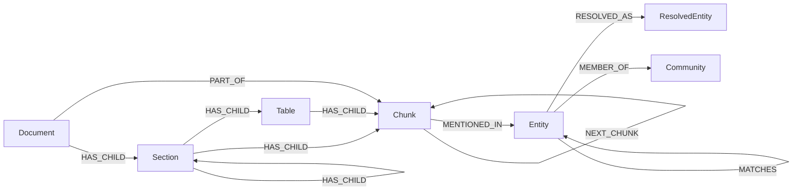

# Knowledge graph

Agentic GraphRAG keeps documents, chunks, entities and community summaries in one property graph in Neo4j.

## Why it exists

Every fact in an answer must trace back to text. A graph of only entities cannot show where a fact came from. A graph of only text cannot connect facts.

Agentic GraphRAG keeps both in one graph. An entity points to the chunks that mention it. A chunk points to the document that holds it. You can walk from an answer back to its source.

## How it works

*The node kinds and their edges. Entity nodes use your schema's type names as labels. `PART_OF` also joins a document to each section, table and figure.*

The graph has these kinds of node:

1. Document: one node for each logical document. Its `document_key` stays the same when the content changes. It holds the source location, the title and the current content hash.
2. Section: one heading of a document. It holds the heading, its depth, and its page range or character range. It holds no text: the chunks under it hold the text. A section has a stable `section_key` that stays the same while the heading path stays the same.
3. Table and Figure: one node for each table or figure. A table holds its caption, its column names and its row count. A figure holds its caption and its page box, not the image.
4. Chunk: one retrieval-sized piece of text. It holds the text, its location in the source, the headings above it, the sections it covers and the chunker that made it.
5. Entity: one node for each name and type, such as the person "Ada Lovelace". Its label is the type from your schema. The same name with two types makes two entities. It records which chunks mention it.
6. ResolvedEntity (see [Matching and resolved entities](./resolved-entities.mdx)): a group of entities that the resolver decided are the same thing. It exists only for groups of two or more.
7. Community (see [Communities](./communities.mdx)): a group of related entities. It holds a title, a summary, a rating and findings.

The edges connect them:

- `HAS_CHILD` builds the tree. It joins a document or section to its sections, tables, figures and chunks, and a table to its chunks. It carries an `order`, the reading order of the child.
- `HAS_DOCUMENT` joins the source file of a record file, such as a CSV file, to each of its row documents.
- `PART_OF` joins a document to each of its sections, tables, figures and chunks. It has a start time and an end time. The edge is open while the node belongs to the current version of the document.
- `NEXT_CHUNK` joins two neighbouring chunks of one document.
- `MENTIONED_IN` joins a chunk to each entity it mentions.
- A schema relation joins two entities, for example `WORKED_WITH`. Only the patterns that your schema allows can exist.
- `MATCHES` joins two entities that the resolver matched. See [Matching and resolved entities](./resolved-entities.mdx).
- `RESOLVED_AS` joins an entity to its resolved entity.
- `MEMBER_OF` joins an entity to its community.

## Example

Take a note with two sentences about Ada Lovelace, Charles Babbage and the Analytical Engine. With the `GENERIC` preset, one run gives this graph:

| Kind | Count |
| --- | --- |
| Document | 1 |
| Section | 1 |
| Chunk | 1 |
| Entity | 5 |
| `HAS_CHILD` edges | 2 |
| `PART_OF` edges | 2 |
| `MENTIONED_IN` edges | 5 |

The five entities are two people, one place, one product and one event. The preset has one relation type, and the extractor found no relation in this text, so the graph has no relation edge. A stricter schema for your domain gives the extractor more to look for.

Design choices

Why are chunks nodes? A chunk node lets an answer cite its source. It also lets a search step from one chunk to its neighbours.

Why does `PART_OF` have an end time instead of being deleted? A changed document closes its old edges and opens new ones. The old chunks stay as history. Search reads only open edges, so a removed document leaves retrieval at once.

Why does the resolver add a ResolvedEntity instead of merging entities? A match is a judgement. The original entity nodes stay, so a wrong match loses no information.

Why is the type the label? The type is what you filter and index by. Every Agentic GraphRAG node also carries an internal marker label, so Agentic GraphRAG can find its own nodes in a shared database.

Why does a chunk list its sections as a property and not as edges? A chunk can span several sections. It stores their ids in `section_ids`, so a reader can find them without a traversal. The [Chunking](./chunking.mdx) page explains how a chunk records its sections.

## Related

- [Ingestion pipeline](./ingestion.mdx) describes how the graph is written.
- [Chunking](./chunking.mdx) describes how chunks are made.
- [Update and delete documents](/guides/update-and-delete-documents) shows how versions work.
- [Common API](/api/common) lists the models.
