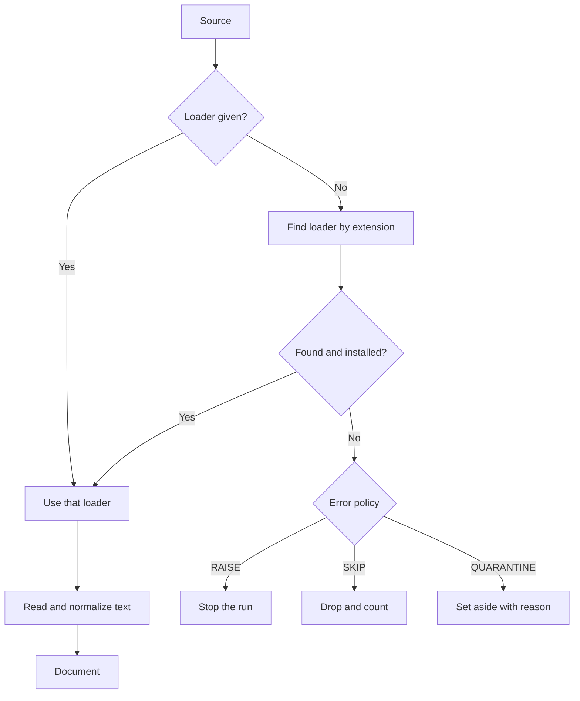

# Loading documents

A loader turns a source into one or more documents. Agentic GraphRAG picks the loader from the file extension. Each prose document comes with its sections: the headings and the content under them.

## Why it exists

Real corpora mix formats: Markdown notes, PDFs, spreadsheets, chat exports. The later stages must not care which one they get. A loader hides the format and returns one shape: a document with text, source details and a stable identity.

## How it works

*The loader comes from you or from the extension. A source that fails follows the error policy.*

1. Pick. You can pass a loader for a single file. Otherwise Agentic GraphRAG looks up the extension. When two loaders claim an extension, the preferred one wins. If that loader needs a package that is not installed, Agentic GraphRAG uses another loader for the extension when one exists. If none exists, the source fails with a missing-package error.
2. Read. The loader detects the text encoding. It removes the byte-order mark, changes line endings to LF, and applies Unicode form NFKC. You can change each of these values.
3. Build. The loader makes a document. A document holds the text, the source location, the format, a content hash, the loader name and its sections. A section holds a heading, its depth and the units of content under it: paragraphs, lists, tables and figures.

### Prose and record sources

A prose source makes one document for each file. A record source makes one document for each record: a CSV row, a JSON Lines line, or an element of a JSON array. A record document takes its text from one column. You can name the column. If you do not, Agentic GraphRAG uses a column called `text`, `body`, `content` or `description`, and otherwise the last column.

### Supported formats

| Format | Extensions | Loader |
| --- | --- | --- |
| Plain text | `.txt`, `.log` | Core, one section |
| XML | `.xml` | Core, the text of the elements |
| Markdown | `.md`, `.markdown` | Docling |
| HTML | `.html`, `.htm` | Docling |
| AsciiDoc | `.adoc`, `.asciidoc` | Docling |
| Word, PowerPoint, Excel | `.docx`, `.pptx`, `.xlsx` | Docling |
| PDF | `.pdf` | Docling, needs the `docling` extra |
| Images | `.png`, `.jpg`, `.jpeg`, `.tif`, `.tiff`, `.bmp` | Docling, needs the `docling` extra |
| CSV and TSV | `.csv`, `.tsv` | Core, one document per row or one for the table |
| JSON Lines | `.jsonl`, `.ndjson` | Core, one document per line |
| JSON | `.json` | Core, one document per array element, or one for an object |
| Chat files | `.jsonl`, `.ndjson`, `.json` | Chat loader, passed by you, one section per message |

Docling reads Markdown, HTML, AsciiDoc, Word, PowerPoint and Excel files without a model, and the base install includes it. PDF and image files need the layout and table models, which the `docling` extra installs. The first PDF you add downloads about 500 MB of models. Docling does not read CSV files, because a CSV row needs its own identity. The chat loader has no extension of its own, because `.jsonl` and `.json` already belong to the record loaders. You pass it for a single file.

### Sections

A section is a heading and the content under it. A PDF gets its heading depth from its bookmarks. A PDF without bookmarks gets it from numbered headings, such as "3.2 Results", but only when it has at least three headings and at least half are numbered; otherwise its headings stay at depth 1. A document with no headings has one section with an empty heading. A record row has no sections. A file in Markdown, HTML or Word has no page numbers, so its chunks have no page spans.

## Example

You add `report.pdf` and `notes.md` in one call. The registry sends both files to Docling. Both become prose documents with sections. If the `docling` extra is missing, the PDF fails with a missing-package error, and the error policy decides whether the run goes on. The Markdown file still loads.

Design choices

Why does a document hash depend on the loader? A text loader hashes the decoded text. A docling loader hashes the raw file bytes, because docling can parse the same file differently between versions or machines. A raw hash keeps the identity stable.

Why do offsets point into the normalized text? Every chunk offset counts characters in the text after normalization. If you need offsets in the raw source, choose no normalization.

Why does each format have its own winner? Docling reads AsciiDoc structure better than the core reader, which scans for headings only. So docling wins for AsciiDoc, Markdown and HTML. For CSV the core loader wins: it is the only claimant, and a CSV row needs its own identity. A blanket rule such as "installed extras win" chooses the wrong loader for some formats.

Why is docling an extra? Optional formats ship behind extras. A text-only install stays small.

## Related

- [Chunking](./chunking.mdx) describes the next stage.
- [Ingest documents](../guides/ingest-documents.mdx) shows how to add each kind of source.
- [Loaders API](../api/loaders/index.md) lists every loader and read option.
