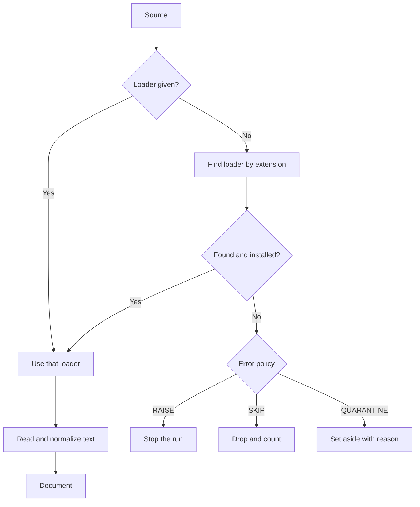

# Loading documents

A loader turns one source into one or more documents. agrag picks the loader from the file extension.

## Why it exists

Real corpora mix formats: Markdown notes, PDFs, spreadsheets, chat exports. The later stages must not care which one they get. A loader hides the format and returns one shape: a document with text, source details and a stable identity.

## How it works

*The loader comes from you or from the extension. A source that fails follows the error policy.*

1. **Pick.** You can pass a loader for a single file. Otherwise agrag looks up the extension. When two loaders claim an extension, the preferred one wins. If that loader needs a package that is not installed, agrag uses another loader for the extension when one exists. If none exists, the source fails with a missing-package error.
2. **Read.** The loader detects the text encoding. It removes the byte-order mark, changes line endings to LF, and applies Unicode form NFKC. You can change each of these settings.
3. **Build.** The loader makes a document. A document holds the text, the source location, the format, a content hash and the loader name.

### Prose and record sources

A prose source makes one document for each file. A record source makes one document for each record: a CSV row, a JSON Lines line, or an element of a JSON array. A record document takes its text from one column. You can name the column. If you do not, agrag uses a column called `text`, `body`, `content` or `description`, and otherwise the last column.

### Supported formats

| Format | Extensions | Loader |
| --- | --- | --- |
| Plain text | `.txt`, `.log` | Core |
| Markdown | `.md`, `.markdown` | Core |
| HTML | `.html`, `.htm` | Core |
| AsciiDoc | `.adoc`, `.asciidoc` | Docling when installed, otherwise core |
| CSV and TSV | `.csv`, `.tsv` | Core, one document per row or one for the table |
| JSON Lines | `.jsonl`, `.ndjson` | Core, one document per line |
| JSON | `.json` | Core, one document per array element, or one for an object |
| PDF, Word, PowerPoint | `.pdf`, `.docx`, `.pptx` | Docling |
| Images | `.png`, `.jpg`, `.jpeg`, `.tif`, `.tiff`, `.bmp` | Docling |
| XML | `.xml` | Docling |
| Chat files | `.jsonl`, `.ndjson`, `.json` | Chat loader, passed by you |

Docling loaders need the `docling` extra. For Markdown, HTML and CSV, the core loader wins even when docling is installed. The chat loader has no extension of its own, because `.jsonl` and `.json` already belong to the record loaders. You pass it for a single file.

## Example

You add `report.pdf` and `notes.md` in one call. The registry sends the PDF to the docling loader and the Markdown file to the core Markdown loader. Both become prose documents. If the `docling` extra is missing, the PDF fails with a missing-package error, and the error policy decides whether the run goes on.

Design choices

**Why does a document hash depend on the loader?** A text loader hashes the decoded text. A docling loader hashes the raw file bytes, because docling can parse the same file differently between versions or machines. A raw hash keeps the identity stable.

**Why do offsets point into the normalized text?** Every chunk offset counts characters in the text after normalization. If you need offsets in the raw source, choose no normalization.

**Why does each format have its own winner?** Docling reads AsciiDoc structure better than the core reader, which scans for headings only. So docling wins for AsciiDoc. For Markdown, HTML and CSV the core loader wins. A blanket rule such as "installed extras win" would choose the wrong loader for some formats.

**Why is docling an extra?** Optional formats ship behind extras. A text-only install stays small.

## Related

- [Chunking](./chunking.mdx) describes the next stage.
- [Ingest documents](/guides/ingest-documents) shows how to add each kind of source.
- [API reference](/api) lists every loader and read option.
