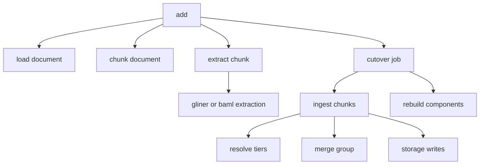

# Observability

Agentic GraphRAG records what it does as OpenTelemetry traces. You supply the tracer. Agentic GraphRAG never installs one for you.

## Why it exists

A GraphRAG run has many steps: loading, chunking, extraction, model calls, resolution, storage, retrieval, and agent turns. When an answer is wrong or slow, you must see which step did what. A trace shows each step, how long it took, and what it received and returned.

OpenTelemetry is a vendor-neutral standard. Any tool that reads it can show an Agentic GraphRAG trace.

## How it works

*The main spans of one `add` call. `load document` appears only for file sources. Store and embedding spans nest below the step that calls them.*

1. You create a tracer with the OpenTelemetry SDK. You choose where the spans go: memory, a file, or an OTLP endpoint.
2. You pass the tracer to `Graph.open`. You also pass it to the stores and embedders you want traced. Use one tracer for all of them so their spans nest.
3. Each component opens a span for each step. When you pass no tracer, Agentic GraphRAG uses a no-op tracer that records nothing.
4. For an agent run, Agentic GraphRAG adds one callback per run. The callback records the planner, researcher, verifier, tool calls, and model calls as spans under your active span.

## What a span holds

A span is one timed step. Each span has a name, a start and end time, a status, and attributes. The attributes hold counts, ids, and the text of the step. The Trace spans reference lists every span and attribute.

Spans hold full text. That includes the question, the evidence, the request and response of each model call, and graph queries with their parameter values. Vectors are left out. Request headers of model calls never appear.

## Failures

A failed stage marks its span as an error and records the exception. The failure record that the ingestion result returns holds the trace id and the span id. You can jump from the record to the trace.

Some steps fall back and continue. They record the exception on the span but leave the status unchanged, because the call still succeeded.

## A worked example

You add one short text with the local extractor. The trace shows one `add` span. Under it, `chunk document` reports one chunk. The extraction span reports four entities and no relations. The resolution spans report four compared pairs and none that need a model. The storage spans report one chunk node, one document node, and four mention edges.

Design choices

Why do you pass the tracer in? A global tracer ties every graph in a process to one destination, and it changes your own telemetry. A passed tracer lets two graphs send traces to two places. It also lets tests run in parallel.

Why does no tracer cost nothing? Without a tracer, Agentic GraphRAG uses a no-op tracer. Spans are created but never recorded.

Why does an agent run use one callback per run? The callback holds state for one run. A new callback for each run keeps two runs apart. Agentic GraphRAG installs no global instrumentation.

Why are tool spans made current? Spans that Agentic GraphRAG opens inside a tool then nest under the tool's span. Without this step they sit beside it.

Why does a failure record hold a trace id? A failure in a batch of many documents is hard to find in a large trace. The id takes you straight to the span.

## Related

- Guide: [Trace an agent run](../guides/trace-an-agent-run.mdx)
- Concepts: [Ingestion pipeline](./ingestion.mdx), [Agent loop](./agent-loop.mdx), [Retrieval](./retrieval.mdx)
- Reference: [Trace spans](../reference/trace-spans.mdx), [Observability API](/api/observability)
