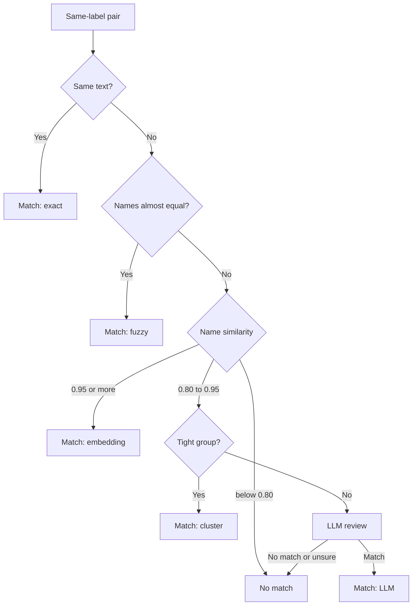

# Entity resolution

Entity resolution decides which mentions name the same real-world thing. It only decides. The page [Matching and resolved entities](./resolved-entities.mdx) explains what Agentic GraphRAG writes after a decision.

## Why it exists

One thing has many names. A corpus can say "Charles Babbage", "Babbage Charles", and "C. Babbage". A graph with three nodes splits the evidence. A search then finds only a part of it.

A wrong match costs more than a missed match. A missed match can be found later. A wrong match mixes the facts of two different things. For this reason, every tier prefers "no match" when it is not sure.

## How it works

*A pair goes down the tiers. The first tier that is sure decides.*

1. Only mentions with the same label are compared. A `Person` is never compared with a `Location`.
2. Exact tier. Two mentions match when their text is equal after trimming spaces and ignoring letter case.
3. Fuzzy tier. The tier compares the words of both names and ignores their order. A score of 0.97 or more is a match. A lower score is not a rejection. It only means that the fast path does not apply.
4. Embedding tier. Each name becomes a vector. A cosine similarity of 0.95 or more is a match. A similarity below 0.80 drops the pair. A similarity from 0.80 to 0.95 makes the pair ambiguous.
5. Cluster tier. Ambiguous pairs are grouped by average similarity. A tight group is a match without an LLM call.
6. LLM tier. An LLM reads each remaining pair with its context. It answers match, no match, or uncertain. Only a match merges. The LLM sees at most 500 pairs for each label, most similar first.

If no LLM is configured, the remaining pairs stay unmatched. The graph stays correct and is less complete.

## Two scopes

`Graph.add` compares the mentions of one call with each other and with similar entities that the graph already stores. `Graph.consolidate` runs the same tiers over every entity in the graph, when you ask for it. If you added data before an LLM was configured, use it. The guide [Consolidate duplicates](../guides/consolidate-duplicates.mdx) shows how.

## Example

| Pair | Deciding tier | Result |
| --- | --- | --- |
| "Babbage Charles" and "Charles Babbage" | Fuzzy (score 1.0) | Match |
| "C&#46; Babbage" and "Charles Babbage" | LLM | Match: "C&#46;" is a standard short form of "Charles" |
| "Analytical Engine" and "Difference Engine" | LLM | No match: two different machines |
| "Cambridge" (Location) and "Cambridge" (Organization) | Not compared | Different labels |

Design choices

Why zones and not a chain of vetoes? A low fuzzy score never rejects a pair. "Ada King" and "Ada Lovelace" share few characters, but they name one person. The embedding and LLM tiers still get to see the pair.

Why cluster before the LLM? A tight group of similar names needs no judgment. Grouping first sends fewer pairs to the LLM.

Why cap the LLM pairs for each label? The cap bounds the cost. One call makes at most ceil(L × 500 ÷ 10) LLM requests for L labels.

Why does "unsure" mean no match? A missed match is recoverable with `Graph.consolidate`. A wrong match corrupts the graph.

Why compare only equal labels? A city and a company can have the same name. Keeping labels apart stops a merge across types.

## Related

- Guide: [Consolidate duplicates](../guides/consolidate-duplicates.mdx)
- Guide: [Extract and resolve entities](../guides/extract-and-resolve.mdx)
- Previous: [Extraction](./extraction.mdx). Next: [Matching and resolved entities](./resolved-entities.mdx)
- Reference: [Ingestion API](../api/ingestion/index.md)
