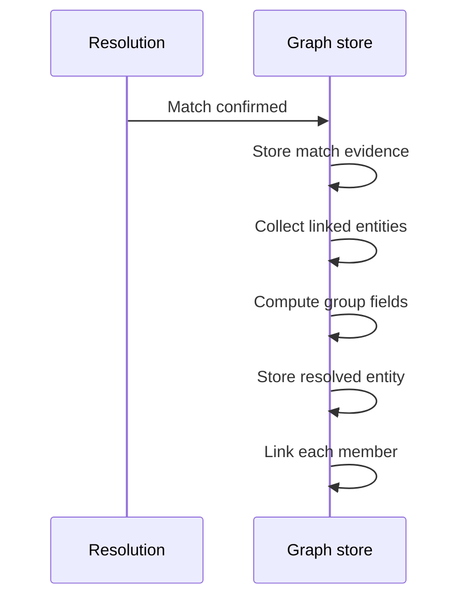

# Matching and resolved entities

When resolution decides that two entities match, Agentic GraphRAG records the match and derives one resolved entity. A resolved entity is one node for a group of matches. The two original entities stay in the graph.

## Why it exists

A merge that rewrites or deletes nodes is hard to undo. A later run can learn that two names belong to two different people. If the nodes were merged, their facts are already mixed.

For a judgment call, Agentic GraphRAG does not rewrite the entities. It writes a link between them. It then derives one summary node from the linked group. You can read every decision, and a later re-evaluation can deactivate a link. No source data is lost.

Exact matches are the one exception. Two mentions with the same label and the same normalized text are the same entity from the start. They share one node. The node counts the mentions it received and lists every source chunk.

## How it works

*A match adds links and one derived node. It changes no existing entity.*

1. Resolution confirms that two entities match. It records the tier, the score when one exists, and the reason when an LLM decided.
2. Agentic GraphRAG writes a `MATCHES` edge between the two `Entity` nodes. The edge keeps that record and the time of the decision.
3. Agentic GraphRAG collects the connected group. If A matches B and B matches C, then A, B, and C are one group.
4. Agentic GraphRAG computes one `ResolvedEntity` for the group. The next section explains how.
5. Agentic GraphRAG writes the `ResolvedEntity` node, and one `RESOLVED_AS` edge from each member to it.
6. Retrieval can search resolved entities. Agentic GraphRAG does not move the relations of a member. They stay on the member.

## How the group gets its name and properties

Agentic GraphRAG reads the members in a fixed order that depends on their ids. For each property, including the name, it keeps the first value that it meets. The same stored members always give the same result. The order does not judge which name reads best, and two separate ingests of the same text can give two different names.

For the description, Agentic GraphRAG asks an LLM to write one summary of all different descriptions. If no LLM is available, or the call fails, Agentic GraphRAG joins the descriptions with " | " and records the failure. No description is dropped.

## Example

Three entities come from three documents: "Babbage Charles", "Charles Babbage", and "C. Babbage".

| Link | Deciding tier |
| --- | --- |
| Babbage Charles and Charles Babbage | Fuzzy, score 1.0 |
| C. Babbage and the other two | LLM |

The result is one `ResolvedEntity` with three `RESOLVED_AS` edges. In one test run its name was "Babbage Charles". In another run over the same text it was "Charles Babbage", because entity ids differ between ingests.

Design choices

Why not rewrite or delete the nodes? A wrong match then needs no repair. The original entities and their relations are still there.

Why derive a node and not pick a winner? No member is the truth. The group can grow or shrink when a link changes. Agentic GraphRAG recomputes the node from the current members each time.

Why keep the tier, score, and reason on each link? A link is a decision. The record lets you audit it later.

Why does the name come from a fixed order? A fixed order gives the same result each time Agentic GraphRAG recomputes the node from the same members. It does not choose the best name. If a name matters to you, read the members and choose one in your own code.

Why do exact matches share one node? Equal text is identity. There is nothing to judge, and nothing to undo.

## Related

- Guide: [Consolidate duplicates](../guides/consolidate-duplicates.mdx)
- Previous: [Entity resolution](./resolution.mdx). Next: [Communities](./communities.mdx)
- Concept: [Knowledge graph](./knowledge-graph.mdx)
- Reference: [Ingestion API](../api/ingestion/index.md)
