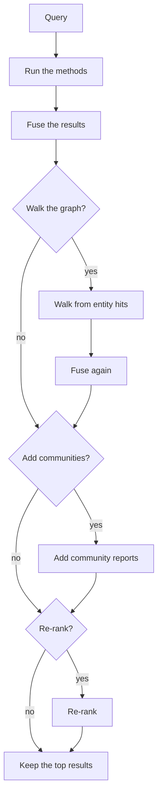
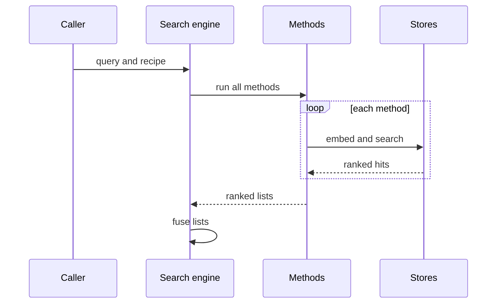
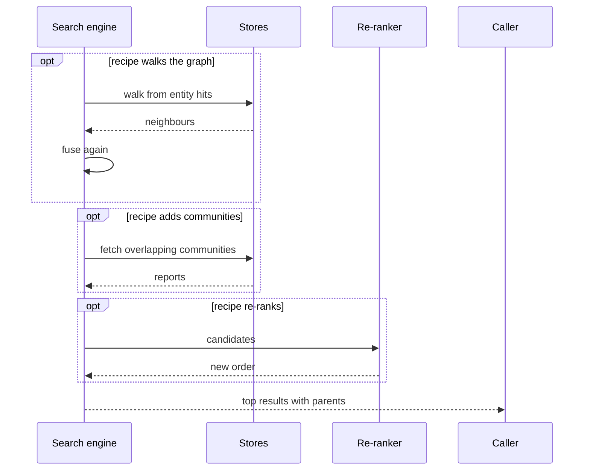

# Retrieval

Retrieval finds the evidence that answers a query. It runs several search methods at the same time, merges their results, and can widen and re-order them before it returns the top results.

## Why it exists

Graph data answers questions in different ways. A fact can sit in a source passage, on an entity, in a relation between entities, or in a summary of a whole topic. No single search finds all four. A name lookup works for "Ada Lovelace". It does not work for "the main themes in this corpus".

Retrieval gives each kind of evidence its own search method. A recipe picks the methods for a query. Reciprocal Rank Fusion merges the results, so no method's score scale takes over.

## How it works

*The engine runs these steps in order. A diamond step runs only when the recipe asks.*

1. **Run the methods.** The recipe names one or more methods. The engine runs them at the same time. If one method fails, the others still return results.
2. **Fuse.** The engine merges the ranked lists into one list and removes duplicates.
3. **Walk the graph (optional).** The engine follows relations outward from the entity hits and fuses the neighbours into the list.
4. **Add communities (optional).** The engine adds the reports of communities that overlap the entities found.
5. **Re-rank (optional).** A cross-encoder model, or the graph distance to the top entity hits, sets a new order.
6. **Cut.** The engine keeps the top results, up to the limit of the recipe.

*One query, part 1: the engine runs the methods and fuses their ranked lists.*

*One query, part 2: optional steps widen and re-order the fused list. Then the engine returns the top results.*

## Methods

| Method | What it finds |
|---|---|
| `entity` | Entities whose name and description match the meaning of the query. |
| `chunk` | Passages of source text. Each hit is a small child chunk that comes back with its parent chunk. |
| `community` | Reports on topics. |
| `text2cypher` | Values that a graph query can compute, such as counts. A model writes a read-only query from the question. |

The graph walk is a step, not a method. A recipe switches it on.

## Recipes

A recipe is a named list of settings. It is data, so you can read it and copy it.

| Recipe | Methods | Extra steps | Results |
|---|---|---|---|
| `ENTITY` | entity | none | 10 |
| `CHUNK` | chunk | none | 10 |
| `HYBRID` | entity, chunk | none | 10 |
| `HYBRID_RERANKED` | entity, chunk | community reports, cross-encoder re-rank | 10 |
| `GRAPH_EXPAND` | entity | graph walk, community reports | 20 |
| `THEMATIC` | community | none | 5 |
| `TEXT2CYPHER` | text2cypher | none | 10 |

## Fusion

Reciprocal Rank Fusion scores an item by its rank in each list, not by its raw score. An item that two methods find scores higher than an item that one method finds. Each method gives an item one vote, at its best rank. A method cannot lift an item by returning it twice.

Fusion runs even when a recipe has one method. It also removes duplicates, so the re-ranker never sees the same item twice.

## Filters

A filter limits a search by entity label, document, property value, or relation type. Labels apply to entity search only. Relation types limit the graph walk. The other filters apply to entity, chunk, and community search.

## A worked example

The query is "Who worked with Babbage?" and the recipe is `HYBRID`. Entity search ranks the entities Charles Babbage and Ada Lovelace. Chunk search returns the chunk that names both. Fusion merges the two lists. The caller gets five results: four entities and one chunk. The chunk comes with its parent chunk, so the caller can show the full passage.

Design choices

**Why fuse ranks and not scores?** A vector search, a keyword search, and a graph walk score on different scales. Ranks compare across methods. Scores do not.

**How do community reports survive the re-rank?** The cross-encoder orders only the passages and entities. After it runs, the recipe keeps up to three slots for community reports. The re-rank cannot push every report out of the results.

**Why does one failed method not fail the search?** A timeout in one method should not hide good results from another. The engine logs the failure and records it on the trace. If every method fails, the engine raises an error.

## Related

- Guide: [Retrieve and answer](../guides/retrieve-and-answer.mdx)
- Concepts: [Chunking](./chunking.mdx), [Communities](./communities.mdx), [Graph storage](./graph-storage.mdx), [Agent loop](./agent-loop.mdx)
- Reference: [API reference](/api)
