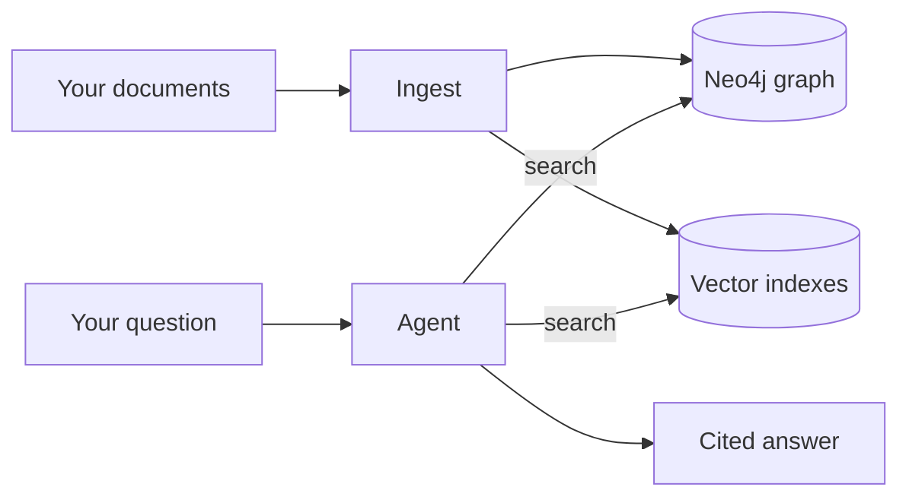

# Introduction

Agentic GraphRAG turns your documents into a knowledge graph. It then answers questions from that graph and cites its evidence.

## The problem

A plain vector search finds passages that look like your question. It cannot join a fact in one document to a fact in another.

Take the question "Who founded the company that Satya Nadella works at?" One passage says that Satya Nadella works at Microsoft. A different passage says that Bill Gates founded Microsoft. No single passage answers the question. A system must join the two facts.

A knowledge graph stores those joins. Each entity is a node. Each fact is an edge. Agentic GraphRAG builds the graph from your text and follows the edges to find the answer.

## What Agentic GraphRAG does

- It reads your files and splits them into chunks.
- It finds entities and relations in each chunk, with a schema that you define.
- It merges mentions of the same thing into one entity.
- It stores the graph in Neo4j. It can also index vectors in Qdrant, Weaviate, or Milvus.
- It answers questions with an agent that plans, searches, and reviews its own evidence.
- It cites the evidence for every answer.

## How it works

Agentic GraphRAG has two flows. Ingestion builds the graph. Querying reads it.

*Ingestion writes the stores. The agent reads them and returns a cited answer.*

1. You add documents. Agentic GraphRAG loads them, splits them into chunks, and extracts entities and relations.
2. Agentic GraphRAG resolves duplicate mentions, then writes the graph and its vector indexes.
3. You ask a question. The agent plans sub-questions and searches the stores.
4. A verifier reviews the evidence. The agent then writes an answer with citations.

## Who it is for

Use Agentic GraphRAG if you:

- build question answering over documents that you own.
- need answers that cite their sources.
- want to define your own entity and relation types.

Agentic GraphRAG is pre-1.0. Its API can change between releases.

## What you need

- Python 3.11 or newer.
- A Neo4j database, version 5.23 or newer. The [Quickstart](/get-started/quickstart) uses the free Neo4j Aura tier.
- An OpenAI-compatible LLM endpoint. You need it only to ask questions with the agent, or to extract with an LLM.

## Where to go next

- [Quickstart](/get-started/quickstart): build and inspect your first graph in about 10 minutes.
- [Installation](/get-started/installation): choose the extras that you need.
- [Architecture](/concepts/architecture): how ingestion and querying fit together.
- [Knowledge graph](/concepts/knowledge-graph): what Agentic GraphRAG stores.
- [Ingest documents](/guides/ingest-documents): add files, text, and prebuilt documents.
- [Retrieve and answer](/guides/retrieve-and-answer): search the graph and get cited answers.
- [API reference](/api): every class and function.
