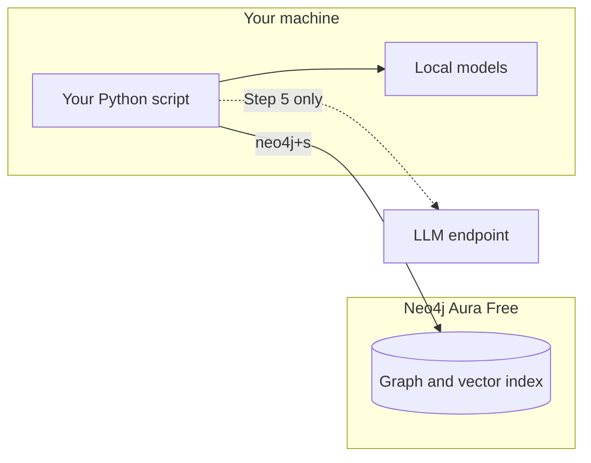

# Quickstart

In this tutorial, you build a small knowledge graph from three sentences. You then look at what `agrag` stored. At the end, you can ask the graph a question.

The tutorial takes about 10 minutes on a typical connection. Most of the time goes to the first download of libraries and models.

## What you need

- Python 3.11 or newer, and [uv](https://docs.astral.sh/uv/).
- A free Neo4j Aura account. You can use Docker instead, as the dropdown in step 1 shows.
- For step 5 only: an OpenAI-compatible LLM endpoint and API key.

## What runs where

Your script runs on your machine, together with two small models. The graph lives in Neo4j Aura. Only the optional agent step calls an LLM.



*The script and the models run locally. The graph is stored in Aura.*

## Step 1: Create a free Neo4j instance

1. Open [console.neo4j.io](https://console.neo4j.io) and sign in.
2. Create a free AuraDB instance.
3. Download the credentials file when Aura shows the password. Aura shows the password one time.
4. Wait until the instance is running.

:::note
Aura Free pauses an instance after 72 hours without use. Aura deletes an instance that stays paused for 30 days. To resume an instance, use the Play button on its card.
:::

Make a folder for the tutorial:

```bash
mkdir agrag-quickstart
cd agrag-quickstart
```

Copy the credentials file into the folder and rename it `.env`. `agrag` reads the connection settings `NEO4J_URI`, `NEO4J_USERNAME`, `NEO4J_PASSWORD`, and `NEO4J_DATABASE` from this file. The URI starts with `neo4j+s://`.

<details>
<summary>Run Neo4j on your machine with Docker instead</summary>

Start a Neo4j container. It needs about 30 seconds before it accepts connections.

```bash
docker run -d --name agrag-neo4j -p 7687:7687 \
  -e NEO4J_AUTH=neo4j/agrag-quickstart neo4j:5.26.0-community
```

Create a file named `.env` in the tutorial folder:

```text
NEO4J_URI=bolt://localhost:7687
NEO4J_USERNAME=neo4j
NEO4J_PASSWORD=agrag-quickstart
```

</details>

## Step 2: Install agrag

Create a virtual environment and install the packages:

```bash
uv venv
source .venv/bin/activate   # On Windows: .venv\Scripts\activate
uv pip install "agentic-graphrag[neo4j,extract,embed-local]" --torch-backend=auto
```

The `--torch-backend=auto` flag picks the PyTorch build for your machine, such as a CPU-only build when it finds no GPU. See [Installation](/get-started/installation#choose-a-pytorch-build) for the other methods.

## Step 3: Build the graph

A schema tells `agrag` which entity types and relation types to look for. This schema has three entity types and three relation types. Each relation names the entity types that it joins.

Save this script as `build_graph.py`:

```python
import asyncio

from agrag.common.data_models.graph_schema import EntityType, GraphSchema, RelationType
from agrag.embedding import build_embedder
from agrag.graphdb import build_graph_store
from agrag.ingestion import Graph
from agrag.ingestion.extract import GlinerExtractor

schema = GraphSchema(
    name="company-facts",
    version="1",
    entities=[
        EntityType(label="Person", description="A named individual."),
        EntityType(label="Organization", description="A company or institution."),
        EntityType(label="Location", description="A city or country."),
    ],
    relations=[
        RelationType(
            label="FOUNDED",
            description="A person founded an organization.",
            patterns=[("Person", "Organization")],
        ),
        RelationType(
            label="WORKS_AT",
            description="A person works at an organization.",
            patterns=[("Person", "Organization")],
        ),
        RelationType(
            label="HEADQUARTERED_IN",
            description="An organization has its headquarters in a location.",
            patterns=[("Organization", "Location")],
        ),
    ],
)

TEXT = (
    "Satya Nadella works at Microsoft. Bill Gates founded Microsoft. "
    "Microsoft is headquartered in Redmond."
)


async def main() -> None:
    graph_store = build_graph_store("neo4j")
    graph = await Graph.open(
        schema=schema,
        graph_store=graph_store,
        embedder=build_embedder("ibm-granite/granite-embedding-small-english-r2"),
        extractor=GlinerExtractor(),
    )
    try:
        result = await graph.add(text=TEXT, return_chunks=True)
        print("documents:", result.ingestion.documents)
        print("chunks:", len(result.chunks))
        print("entities extracted:", result.extraction.entities_extracted)
        print("relations extracted:", result.extraction.relations_extracted)
    finally:
        await graph_store.close()


asyncio.run(main())
```

Run it:

```bash
python build_graph.py
```

The first run downloads two models, about 385 MB in total. The script prints:

```text
documents: 1
chunks: 1
entities extracted: 6
relations extracted: 3
```

## Step 4: Look at the graph

`agrag` stores the graph in Neo4j, so you can query it with Cypher. Save this script as `inspect_graph.py`. The first query lists the entities. The second query lists the relations.

```python
import asyncio

from agrag.graphdb import build_graph_store


async def main() -> None:
    graph_store = build_graph_store("neo4j")
    await graph_store.connect()
    try:
        entities = await graph_store.execute_read(
            "MATCH (e:_AgragNode) "
            "WHERE NOT e:Chunk AND NOT e:Document AND NOT e:Community "
            "AND NOT e:ResolvedEntity "
            "RETURN [l IN labels(e) WHERE l <> '_AgragNode'][0] AS label, "
            "e.name AS name ORDER BY label, name"
        )
        for row in entities:
            print(row["label"], "|", row["name"])

        facts = await graph_store.execute_read(
            "MATCH (a:_AgragNode)-[r]->(b:_AgragNode) "
            "WHERE type(r) IN ['FOUNDED', 'WORKS_AT', 'HEADQUARTERED_IN'] "
            "RETURN a.name AS source, type(r) AS relation, b.name AS target "
            "ORDER BY relation"
        )
        for row in facts:
            print(row["source"], "-", row["relation"], "->", row["target"])
    finally:
        await graph_store.close()


asyncio.run(main())
```

Run it:

```bash
python inspect_graph.py
```

The script prints:

```text
Location | Redmond
Organization | Microsoft
Person | Bill Gates
Person | Satya Nadella
Bill Gates - FOUNDED -> Microsoft
Microsoft - HEADQUARTERED_IN -> Redmond
Satya Nadella - WORKS_AT -> Microsoft
```

Every node that `agrag` writes has the label `_AgragNode`. The first query skips the chunk, document, community, and resolved-entity nodes, so only entities remain.

## What you just built

- **One chunk.** The three sentences were short enough to stay in one chunk. `agrag` stored the text of the chunk, its position in the source, and an embedding.
- **Four entities from six mentions.** The extractor found `Microsoft` three times. Resolution merged the three mentions into one node, because the names match exactly.
- **Three relations.** Each relation links two entity nodes. The extractor reports a relation only when the schema names it.
- **Why the schema names the relations.** The built-in `GENERIC` schema has one broad relation, `RELATED_TO`. On these three sentences, `GENERIC` finds the same six mentions and no relations. Specific relation names, each with a short description, give the extractor something to look for.

<details>
<summary>Why does the script report 6 entities when the graph has 4?</summary>

The extractor counts mentions. A mention is one place in the text where an entity appears. Resolution groups mentions of the same thing into one node. The three mentions of `Microsoft` became one node, so 6 mentions became 4 nodes.

</details>

## Step 5 (optional): Ask a question

The agent plans sub-questions, searches the graph, checks its evidence, and answers with citations. It needs an LLM. Add your endpoint to the `.env` file:

```text
LLM_BASE_URL=https://your-endpoint.example.com/v1
LLM_API_KEY=your-api-key
LLM_MODEL_ID=your-model-name
```

Install the agent extra:

```bash
uv pip install "agentic-graphrag[agents]"
```

Save this script as `ask.py`:

{/* pmd-metadata: fixture:llm_env */}

```python
import asyncio

from agrag.agents.build import build_agent
from agrag.agents.settings import AgentLLMSettings
from agrag.common.data_models.graph_schema import EntityType, GraphSchema, RelationType
from agrag.embedding import build_embedder
from agrag.graphdb import build_graph_store
from agrag.retrieval.search_engine import SearchEngine

schema = GraphSchema(
    name="company-facts",
    version="1",
    entities=[
        EntityType(label="Person", description="A named individual."),
        EntityType(label="Organization", description="A company or institution."),
        EntityType(label="Location", description="A city or country."),
    ],
    relations=[
        RelationType(
            label="FOUNDED",
            description="A person founded an organization.",
            patterns=[("Person", "Organization")],
        ),
        RelationType(
            label="WORKS_AT",
            description="A person works at an organization.",
            patterns=[("Person", "Organization")],
        ),
        RelationType(
            label="HEADQUARTERED_IN",
            description="An organization has its headquarters in a location.",
            patterns=[("Organization", "Location")],
        ),
    ],
)

QUESTION = "Who founded the company that Satya Nadella works at?"


async def main() -> None:
    graph_store = build_graph_store("neo4j")
    await graph_store.connect()
    try:
        engine = SearchEngine(
            graph_store=graph_store,
            embedder=build_embedder("ibm-granite/granite-embedding-small-english-r2"),
            graph_schema=schema,
        )
        agent = build_agent(
            engine=engine,
            llm_settings=AgentLLMSettings.from_openai_compatible_env(),
            graph_schema=schema,
        )
        result = await agent.ainvoke(
            {"messages": [{"role": "user", "content": QUESTION}]}
        )
        answer = result["messages"][-1]
        print(answer["content"] if isinstance(answer, dict) else answer.content)
        print("evidence keys:", ", ".join(result["ledger"].keys))
    finally:
        await graph_store.close()


asyncio.run(main())
```

Run it:

```bash
BAML_LOG=off python ask.py
```

BAML prints every LLM call to the console by default. `BAML_LOG=off` turns that off. On Windows PowerShell, set `$env:BAML_LOG = "off"` first.

The answer varies with your model. This is an example:

```text
Satya Nadella works at Microsoft (E1, E3), which was founded by Bill Gates (E2, E3, C1).
evidence keys: E1, E2, E3, E4, C1, V1
```

The keys in brackets cite the evidence. `E` keys are entities, `C` keys are chunks, and `V` keys are values from a graph query. The agent needed two facts from two sentences. It joined them through the `Microsoft` node.

## Next steps

- [Knowledge graph](/concepts/knowledge-graph): read what the nodes and edges in your graph mean.
- [Ingest documents](/guides/ingest-documents): add files, directories, and text.
- [Configure storage backends](/guides/configure-storage-backends): add a dedicated vector store.
- [Retrieve and answer](/guides/retrieve-and-answer): search the graph and scope the agent.
- [Trace an agent run](/guides/trace-an-agent-run): record what the agent did.
