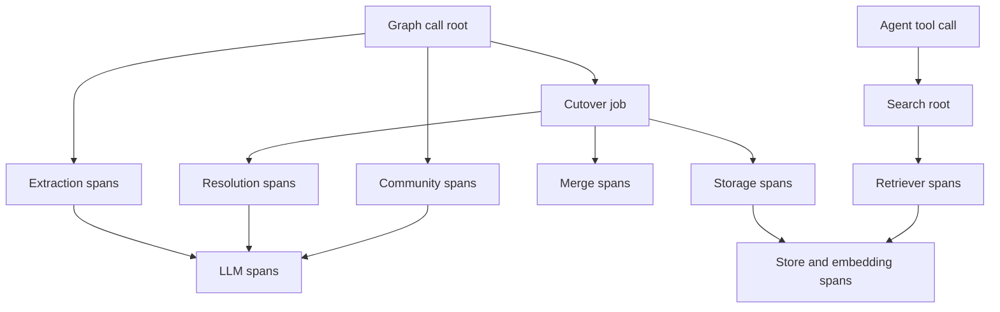

# Trace Spans

This page is the reference for the spans Agentic GraphRAG records when you pass it a
`tracer`. The library emits every span name, attribute, and provider value below.

Tracing is opt-in per object. A `tracer` of `None` opens no recorded span and
costs nothing. Agentic GraphRAG never installs a global provider. You inject
the tracer you want. See [Trace an agent run](../guides/trace-an-agent-run.mdx) for
how to build and pass one.

## How the span families nest



*Each box is a span family. An arrow points from a parent span to the spans that nest below it.*

| Box | Span names |
|---|---|
| Graph call root | `agrag.ingestion.add`, `update`, `delete_document`, `consolidate`, `detect_communities`, and the other root spans in "Ingestion root spans" |
| Extraction spans | `agrag.extraction.*` |
| Cutover job | `agrag.ingestion.cutover_job` and `agrag.ingestion.ingest_chunks` |
| Resolution, Merge, Storage spans | `agrag.resolution.*`, `agrag.merge.*`, `agrag.storage.*` |
| Community spans | `agrag.community.*` |
| LLM spans | `agrag.llm.call`, `agrag.llm.attempt`, `agrag.llm.request` |
| Agent tool call | The OpenInference `TOOL` span of an agent run |
| Search root and retriever spans | `agrag.retrieval.search` and the spans in "The retrieval span tree" |
| Store and embedding spans | `agrag.graphdb.*`, `agrag.vectordb.*`, `agrag.embedding.*`, only when you pass the same tracer to the stores and the embedder |

## The LLM span tree

Every BAML-backed path produces the same three spans, nested. BAML collects
data during the attempt. The path writes the `request`
span after the attempt finishes. The span carries the real request and response.

```text
agrag.extraction.extract_chunk            (INTERNAL)
  agrag.extraction.baml                   (INTERNAL)
    agrag.llm.call                        (INTERNAL)
      agrag.llm.attempt                   (INTERNAL)
        agrag.llm.request                 (CLIENT, kind LLM)
```

| Span | Kind | Attributes |
|---|---|---|
| `agrag.llm.call` | INTERNAL | `agrag.llm.function`, `agrag.llm.attempt_count` |
| `agrag.llm.attempt` | INTERNAL | `agrag.llm.attempt` (1-based) |
| `agrag.llm.request` | CLIENT | the table below |

`agrag.llm.function` is the BAML function name, such as
`ExtractEntitiesAndRelations`. The attempt span records the exception when an
attempt fails. The `call` span reports `ERROR` when the call as a whole fails.

## Ingestion spans

| Span | Attributes |
|---|---|
| `agrag.ingestion.load_document` | `agrag.source_uri`, `agrag.loader_name`, `agrag.normalization` (JSON) |
| `agrag.ingestion.chunk_document` | `agrag.document_key`, `agrag.chunker.strategy`, `agrag.chunker.hash`, `agrag.chunker.settings` (JSON), `agrag.chunker.rule` (a rule index or `fallback`), `agrag.chunks_produced` |
| `agrag.storage.embed_chunks` | `agrag.embedding.heading_context` (bool, whether the embedder got the heading path) |

## Ingestion root spans

Every public `Graph` call opens one root span. The spans in the sections below nest under it.

| Span | Opens when | Attributes |
|---|---|---|
| `agrag.ingestion.open` | `Graph.open` runs | none |
| `agrag.ingestion.resume_incomplete_jobs` | `Graph.open` recovers document jobs that an earlier run left unfinished | none |
| `agrag.ingestion.add` | `Graph.add` runs | none |
| `agrag.ingestion.update` | `Graph.update` runs | none |
| `agrag.ingestion.delete_document` | `Graph.delete_document` runs | none |
| `agrag.ingestion.consolidate` | `Graph.consolidate` runs | none |
| `agrag.ingestion.detect_communities` | `Graph.detect_communities` runs | none |
| `agrag.ingestion.reevaluate` | `Graph.reevaluate` runs | `agrag.entity_count` |
| `agrag.ingestion.deactivate_match` | `Graph.deactivate_match` runs | `agrag.match_id` |
| `agrag.ingestion.cutover_job` | An add, update, or delete runs as one document job | `agrag.verb`, `agrag.document_key`, `agrag.job_id` |
| `agrag.ingestion.ingest_chunks` | The shared step that resolves, merges, and stores extracted chunks | none |

## The ingestion span tree

One `add` call with one chunk and the local extractor produces this tree. `load_document` appears only for `source=` input. Store and embedding spans (`agrag.graphdb.*`, `agrag.embedding.*`, and `agrag.vectordb.*` when a vector store is set) nest below the step that calls them.

```text
agrag.ingestion.add
  agrag.ingestion.load_document           only with source=
  agrag.ingestion.chunk_document
  agrag.extraction.extract_chunk          one per chunk
    agrag.extraction.gliner               or agrag.extraction.baml, agrag.extraction.escalating
      agrag.extraction.model_load         first call only
  agrag.ingestion.cutover_job
    agrag.ingestion.ingest_chunks
      agrag.resolution.global_exact_match
      agrag.resolution.candidate_generation
      agrag.resolution.resolve
        agrag.resolution.exact_fuzzy_pass
        agrag.resolution.embedding_tier
        agrag.resolution.precluster_tier
        agrag.resolution.llm_tier         only with boundary pairs
          agrag.resolution.llm_batch
      agrag.merge.merge_group             one per entity group
      agrag.storage.upsert_chunks
      agrag.storage.upsert_documents
      agrag.storage.embed_chunks
      agrag.storage.upsert_relations
      agrag.storage.upsert_mentioned_in
      agrag.storage.embed_survivors
    agrag.merge.rebuild_components
```

## Resolution, merge, and storage spans

| Span | Attributes |
|---|---|
| `agrag.resolution.global_exact_match` | `agrag.mention_count`, `agrag.exact_match_hits` |
| `agrag.resolution.candidate_generation` | `agrag.mention_count`, `agrag.persisted_candidate_count`, `agrag.in_batch_candidate_count` |
| `agrag.resolution.resolve` | `agrag.entity_count`, `agrag.pair_count`, `agrag.ambiguous_count`, `agrag.failed_llm_requests`, `agrag.cap_truncated_pairs` |
| `agrag.resolution.exact_fuzzy_pass` | `agrag.pair_count`, `agrag.exact_match_count`, `agrag.fuzzy_fast_path_count`, `agrag.fuzzy_uncertain_count` |
| `agrag.resolution.embedding_tier` | `agrag.fuzzy_uncertain_count`, `agrag.hard_merge_count`, `agrag.ambiguous_count` |
| `agrag.resolution.precluster_tier` | `agrag.boundary_pairs_before`, `agrag.auto_merged_count`, `agrag.boundary_pairs_after` |
| `agrag.resolution.llm_tier` | `agrag.boundary_pair_count`, `agrag.selected_pair_count`, `agrag.cap_truncated_pairs`, `agrag.ambiguous_count`, `agrag.failed_llm_requests` |
| `agrag.resolution.llm_batch` | `agrag.batch_size`, `agrag.uncertain_count` |
| `agrag.merge.merge_group` | `agrag.mention_count`, `agrag.conflicts_resolved` |
| `agrag.merge.rebuild_components` | `agrag.component_count` |
| `agrag.merge.rebuild_component` | `agrag.member_count` |
| `agrag.merge.deactivate_component` | `agrag.match_id` |
| `agrag.storage.upsert_chunks` | `agrag.record_count`, `agrag.nodes_written` |
| `agrag.storage.upsert_documents` | `agrag.record_count`, `agrag.nodes_written` |
| `agrag.storage.upsert_relations` | `agrag.record_count`, `agrag.relationships_written` |
| `agrag.storage.upsert_mentioned_in` | `agrag.record_count`, `agrag.relationships_written` |
| `agrag.storage.embed_survivors` | none |
| `agrag.community.embed_batch` | `agrag.batch_size` |

`agrag.resolution.llm_tier` and `agrag.resolution.llm_batch` open only when boundary pairs reach the model. Like `agrag.resolution.llm_verify`, a failed model call there counts as `agrag.failed_llm_requests` and does not set the span to `ERROR`.

## Graph store spans

The Neo4j store opens these spans. Reads and writes carry the query text and the value of every parameter except vectors. A trace shows what each query asked for.

| Span | Attributes |
|---|---|
| `agrag.graphdb.build_driver` | none |
| `agrag.graphdb.execute_read` | `db.system.name`, `db.namespace`, `db.query.text`, `db.query.parameter.<name>` for each non-vector parameter, `agrag.transactional` (inside a transaction) |
| `agrag.graphdb.execute_write` | the same as `execute_read` |
| `agrag.graphdb.transaction` | none |
| `agrag.graphdb.upsert_nodes` | `db.collection.name` (the label), `agrag.record_count`, `agrag.written`, `agrag.failures_count`, `db.operation.batch.size` (only for a write of more than one record) |
| `agrag.graphdb.upsert_relations` | `agrag.record_count`, `agrag.written`, `agrag.failures_count`, `db.operation.batch.size` (only for a write of more than one record) |
| `agrag.graphdb.load_entities` | `agrag.requested_count`, `agrag.loaded_count` |
| `agrag.graphdb.vector_search` | `db.collection.name` (the label), `agrag.limit`, `agrag.k_final`, `agrag.index_missing` (when the index does not exist. The search then returns no hits) |

## Vector store spans

Qdrant, Weaviate, and Milvus open the same names. `db.system.name` is `qdrant`, `weaviate`, or `milvus`. Only Qdrant opens `query_points`, one for each arm of its two-search hybrid query.

| Span | Attributes |
|---|---|
| `agrag.vectordb.build_client` | none |
| `agrag.vectordb.upsert` | `db.collection.name`, `agrag.record_count` |
| `agrag.vectordb.upsert_batch` | `db.system.name`, `db.collection.name`, `agrag.batch_size` |
| `agrag.vectordb.search` | `db.system.name`, `db.collection.name`, `agrag.limit` |
| `agrag.vectordb.hybrid_search` | `db.collection.name`, `agrag.limit`, `agrag.alpha` |
| `agrag.vectordb.query_points` | `db.system.name`, `db.collection.name`, `agrag.query_arm` (`dense` or `sparse`) |
| `agrag.vectordb.scroll` | `db.system.name`, `db.collection.name`, `agrag.limit` |
| `agrag.vectordb.retrieve` | `db.system.name`, `db.collection.name` |
| `agrag.vectordb.count` | `db.system.name`, `db.collection.name` |
| `agrag.vectordb.delete` | `db.system.name`, `db.collection.name` |
| `agrag.vectordb.commit_pending` | `db.collection.name`, `agrag.job_id` |
| `agrag.vectordb.delete_pending` | `db.collection.name`, `agrag.job_id` |

## Embedding spans

| Span | Attributes |
|---|---|
| `agrag.embedding.model_load` | `agrag.model` |
| `agrag.embedding.encode` | `agrag.text_count`, `agrag.cache_hit_count` (dense embedder) |
| `agrag.embedding.query_embed` | `agrag.text_count` (keyword embedder for Qdrant hybrid search) |

## Retrieval loading spans and the agent span

| Span | Attributes |
|---|---|
| `agrag.retrieval.load_communities` | `agrag.requested_count`, `agrag.loaded_count` |
| `agrag.retrieval.load_resolved_entities` | `agrag.requested_count`, `agrag.loaded_count` |
| `agrag.retrieval.community_context` | `agrag.seed_count`, `agrag.top_k` |
| `agrag.agents.run` | none. Only the simple agent (used when the `agents` extra is not installed) opens it. The full loop opens OpenInference spans instead. |

## Domain spans by path

Each LLM path also opens one small domain span carrying its own ids and counts.

| Path | Domain span | Attributes |
|---|---|---|
| Extraction, BAML | `agrag.extraction.baml` | `agrag.chunk_id`, `agrag.entities_extracted`, `agrag.relations_extracted`, `agrag.extraction.heading_context` (bool, whether a section line was sent) |
| Extraction, GLiNER | `agrag.extraction.gliner`, and `agrag.extraction.model_load` around the one-time model build | the same counts. `agrag.model` is on the load span |
| Extraction, escalating | `agrag.extraction.escalating` | `agrag.chunk_id`, `agrag.escalated` (bool) |
| Resolution | `agrag.resolution.llm_verify` | `agrag.pair_count`, `agrag.match_count`, `agrag.uncertain_count`, `agrag.request_failed` (bool) |
| Merge | `agrag.merge.resolve_description` | `agrag.description_count`, `agrag.summarized` (bool) |
| Community | `agrag.community.report_batch` | `agrag.batch_size` |
| Chunk retrieval | `agrag.retrieval.load_parents` | `agrag.parent_count`, `agrag.result.count`, `retrieval.documents` (JSON array of attached parent chunks) |
| Text2cypher | `agrag.retrieval.generate_cypher` | `agrag.is_repair` (bool) |
| Judge | `agrag.eval.judge` | `agrag.eval.judge_model` |

Two of these are conditional:

- `agrag.merge.resolve_description` opens only when the field
  conflicted. The field conflicted when more than one distinct candidate exists. A field
  every mention agrees on adds no span.
- `agrag.retrieval.generate_cypher` opens on every generation, and
  `agrag.is_repair` tells a first attempt from a retry after a failure.

`agrag.resolution.llm_verify` never carries an `ERROR` status. A failed LLM
call resolves to `NO_MATCH`, not an error. The span stays `UNSET` and sets
`agrag.request_failed` instead.

## The retrieval span tree

One `search` call fans out to the recipe's retrievers concurrently. Their
spans are siblings under the root. The `agrag.graphdb.*`, `agrag.vectordb.*`
and `agrag.embedding.*` spans nest below these whenever the caller passed the
same tracer to the stores and the embedder.

```text
agrag.retrieval.search                     RETRIEVER
  agrag.retrieval.entity                   RETRIEVER, one per retriever
    agrag.retrieval.allowed_entity_ids     only with a document scope
    agrag.retrieval.entity_search
      agrag.retrieval.vector_search        one per adaptive pass
    agrag.retrieval.active_member_ids
    agrag.graphdb.load_entities
    agrag.retrieval.resolved_entity_search
  agrag.retrieval.chunk                    RETRIEVER
    agrag.retrieval.vector_search
    agrag.retrieval.load_chunks
  agrag.retrieval.community                RETRIEVER
  agrag.retrieval.text2cypher              RETRIEVER
    agrag.retrieval.generate_cypher
    agrag.retrieval.execute_cypher         one per attempt
    agrag.graphdb.load_entities         one per entity row
  agrag.retrieval.fuse
  agrag.retrieval.bfs                      RETRIEVER, when recipe.bfs
  agrag.retrieval.community_expand         when recipe.community_expand
  agrag.retrieval.rerank.cross_encoder     or rerank.node_distance
    agrag.retrieval.rerank.model_load      only on a cache miss
```

`agrag.retrieval.find_entity` and `agrag.retrieval.traverse` are `RETRIEVER`
roots for direct calls that bypass `search`.
`agrag.retrieval.list_relationship_types` returns strings and carries no kind.
Inside an agent run, the whole tree nests under the OpenInference `TOOL` span
of the tool call that made it.

### Attributes

| Span | Attributes |
|---|---|
| `agrag.retrieval.search` | `agrag.recipe.methods`, `agrag.recipe.limit`, `agrag.recipe.bfs`, `agrag.recipe.community_expand`, `agrag.recipe.reranker`, `agrag.failed_methods` (when a method failed) |
| retrievers (`entity`, `chunk`, `community`, `text2cypher`, `bfs`) | `agrag.limit`. `bfs` also `agrag.seed_count`, `agrag.depth`, `agrag.direction`. `text2cypher` also `agrag.cypher` |
| `agrag.retrieval.find_entity` / `traverse` | `agrag.seed_ids`, `agrag.relation_type`, `agrag.direction`, `agrag.depth`, `agrag.limit`, `agrag.community_expand` on `traverse` |
| `agrag.retrieval.list_relationship_types` | `agrag.seed_ids`, `agrag.relation_type_filter`, `agrag.direction`, `agrag.result_count`, `agrag.result_types` |
| `agrag.retrieval.vector_search` | `agrag.collection`, `agrag.store` (`vector_store` or `graph_native`), `agrag.labels`, `agrag.limit`, `agrag.hit_count`, `agrag.hit_ids`, `agrag.hit_scores` |
| `agrag.retrieval.entity_search` / `resolved_entity_search` | `agrag.limit`, `agrag.passes`, `agrag.hit_count` |
| `agrag.retrieval.load_*` | `agrag.requested_count`, `agrag.loaded_count` |
| `agrag.retrieval.allowed_entity_ids` | `agrag.document_count`, `agrag.entity_count` |
| `agrag.retrieval.active_member_ids` | `agrag.requested_count`, `agrag.superseded_count` |
| `agrag.retrieval.execute_cypher` | `agrag.is_repair`, `agrag.row_count` |
| `agrag.retrieval.fuse` | `agrag.rrf_k`, `agrag.fuse.methods`, `agrag.fuse.method_counts` |
| `agrag.retrieval.community_expand` / `community_context` | `agrag.seed_count`, `agrag.top_k`, `agrag.added_count` on `community_expand` |
| `agrag.retrieval.rerank.cross_encoder` | `agrag.model`, `agrag.input_count`, `agrag.min_score` (when set), `agrag.skipped` (when the extra is missing) |
| `agrag.retrieval.rerank.model_load` | `agrag.model` |
| `agrag.retrieval.rerank.node_distance` | `agrag.seed_count`, `agrag.input_count`, `agrag.path_query_count` |

### Result attributes

Every span that returns a list records its results in full:

- `agrag.result_count`, and arrays `agrag.result_ids`, `agrag.result_scores`,
  `agrag.result_kinds` and `agrag.result_texts` holding every result, with
  no text cap. Array attributes are not subject to the SDK's per-span
  attribute limit.
- For the first 20 results, the span also carries the OpenInference flattened names
  `retrieval.documents.N.document.id`, `.document.content`, `.document.score`
  and `.document.metadata` (a JSON object with `kind` and `method`). Trace
  viewers draw these names as a retrieval panel.

The span records the query and the scope. `input.value` and `agrag.query`
carry the query text. `agrag.filters` carries the scope as JSON, and an empty
scope counts. A step that falls back to empty (a failed load, a
reranker without its extra) records the exception as an event on the
narrowest span. That span's status stays `UNSET`.

## The `agrag.llm.request` span

This is the only span a BAML path tags with the OpenInference LLM kind.

| Attribute | Value |
|---|---|
| `openinference.span.kind` | `"LLM"` |
| span kind | `CLIENT` |
| `llm.provider` | OpenInference value mapped from BAML's provider id, table below |
| `llm.model_name` | the model named in the response body, else the model in the request body |
| `llm.token_count.prompt` / `.completion` | `Usage.input_tokens` / `output_tokens`, omitted when `None` |
| `llm.token_count.total` | prompt plus completion, only when both are present |
| `llm.token_count.prompt_details.cache_read` | `Usage.cached_input_tokens`, only when greater than 0 |
| `agrag.llm.usage_missing` | `true` when the call succeeded and every usage field was `None` |
| `input.value`, `input.mime_type` | the request body text, `application/json` |
| `output.value`, `output.mime_type` | the response body text, `application/json`, or `text/plain` if it does not parse |
| `http.response.status_code` | the response status |
| `error.type` | the status as a string, when it is 400 or higher |
| `agrag.llm.baml_provider` | BAML's raw provider id |
| `agrag.llm.client_name` | the client that made the request |
| `agrag.llm.requested_model` | the model in the request body |
| `agrag.llm.selected` | whether BAML used this call's reply |

The span's status is `ERROR` when the status is 400 or higher, or when the call
got no response at all.

### Provider mapping

BAML's provider ids map to the same OpenInference values the agent path emits.
The same configuration reports the same provider either way.

| BAML provider id | `llm.provider` |
|---|---|
| `openai`, `openai-generic`, `openai-responses` | `openai` |
| `azure-openai` | `azure` |
| `anthropic` | `anthropic` |
| `google-ai`, `vertex-ai` | `google` |
| `aws-bedrock` | `aws` |

An id outside this table stays unchanged. A newly added provider still
produces a usable span.

## Counting calls and tokens

To count the LLM calls in a trace, count the spans tagged with the
OpenInference LLM kind:

```python
def count_llm_calls(spans):
    return sum(
        1
        for span in spans
        if span.attributes.get("openinference.span.kind") == "LLM"
    )
```

Token counts live only on `agrag.llm.request` spans and on the agent and judge
LLM spans. The parent spans never carry them. A sum of
`llm.token_count.prompt` over every span with that kind is exact. Nothing
counts twice.

## What is recorded, and what is not

Nothing withholds text. `agrag.llm.request` records the full request and
response bodies, and the agent and judge spans record the question, tool inputs
and evidence text. The OpenInference redaction environment variables no longer
change any span, on any path. To record less, scrub attributes in a
`SpanProcessor` you configure, or run without a tracer.

No span records two things: the request headers, which carry the
provider key, and the request URL. Graph store spans record the query text and the
value of every parameter except vectors. A parameter can hold source text or entity
names.

## Known limits

- An unparsable reply looks successful: BAML coerces a reply it cannot
  parse into an empty result rather than raising. The span's status is therefore
  `UNSET`. `output.value` is the evidence that the reply was not usable.
- Retries below BAML are invisible: LangChain and the provider SDKs retry
  internally, and one agent or judge LLM span can cover several HTTP requests.
  The `agrag.llm.request` spans, read from BAML's collector, are exact for the
  requests BAML itself made.
- Token semantics match an OpenAI-compatible endpoint only.
  For `anthropic`, `google-ai`, `vertex-ai`, `aws-bedrock` and `azure-openai`,
  the counts are whatever BAML's `Usage` reports.
- The SDK caps attributes at 128 by default. A long agent run can reach that
  limit. The SDK then drops attributes without a warning. Raise `SpanLimits.max_attributes` on
  your provider. Use a sampling processor in production.
- BAML error text includes the request URL: it reaches `output.value`,
  exception events and `StageFailure.error_message`. Never put a provider key
  in a `base_url` query string.
